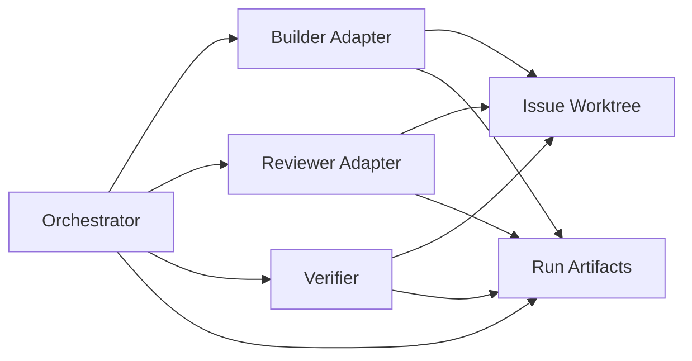
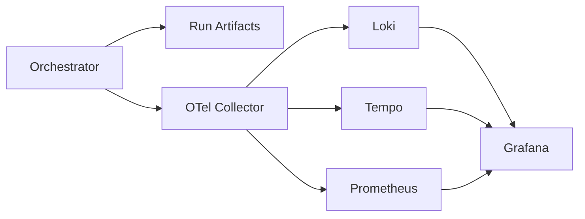

# Observability v1 Design

## 1. Goal

This document defines a low-complexity observability design for SpecOrch v1.

The design target is practical debugging and auditability, not a full production platform on day one.

SpecOrch needs to answer questions like:

- why did a builder turn fail
- which verification step blocked mergeability
- where did an agent stall
- what approvals, tool calls, and fallbacks happened
- how long did each run and turn take

The design should support that without forcing every issue worktree to boot a full monitoring stack.

## 2. Decision

Use a layered model:

1. `v1 baseline`: filesystem-first telemetry
2. `v1 optional`: one shared local observability stack
3. `later`: remote or multi-runner telemetry pipeline

The core rule is:

`Each worktree needs isolated telemetry data, not isolated observability infrastructure.`

That means every run must write its own structured artifacts, but all runs can share the same local query and visualization stack if one is enabled.

## 3. Why Not Per-Worktree Stacks

Do not run a separate Loki, Tempo, Prometheus, and Grafana stack per worktree in v1.

Reasons:

- startup cost is too high for short-lived issue workspaces
- operational complexity rises quickly with multiple active issues
- resource usage becomes wasteful on a local machine
- debugging the observability stack can become harder than debugging SpecOrch
- the actual need is filtering by `issue_id` and `workspace`, not full infrastructure isolation

Per-worktree infrastructure may make sense much later for remote runners or highly isolated execution environments, but it is the wrong default for local dogfooding.

## 4. v1 Architecture

### 4.1 Baseline Architecture



### 4.2 Shared Optional Stack



## 5. v1 Baseline Requirements

Every run must produce local structured telemetry inside the issue workspace.

Required files:

- `report.json`
- `explain.md`
- `events.jsonl`
- `raw_harness_in.jsonl` when a harness transport is used
- `raw_harness_out.jsonl` when a harness transport is used
- `raw_harness_err.log` when a harness transport is used

Recommended directory shape:

```text
.worktrees/<issue-id>/
  task.spec.md
  progress.md
  explain.md
  report.json
  review_report.json
  builder_report.json
  acceptance.json
  telemetry/
    events.jsonl
    raw_harness_in.jsonl
    raw_harness_out.jsonl
    raw_harness_err.log
```

This baseline already supports:

- post-run debugging
- auditability
- deterministic replay of major decisions
- later ingestion into Loki, Tempo, or another backend

## 6. Canonical IDs

Every log event and span-like record should carry correlation IDs.

Minimum required fields:

- `run_id`
- `issue_id`
- `workspace`
- `thread_id`
- `turn_id`
- `item_id`
- `adapter`
- `agent`

Additional useful fields:

- `verification_step`
- `review_verdict`
- `gate_condition`
- `fallback_from`
- `fallback_reason`

If a field is not applicable, it should be omitted or `null`, but the field names themselves should stay consistent across adapters.

## 7. Event Model

### 7.1 `events.jsonl`

Each line should be one structured event.

Suggested schema:

```json
{
  "timestamp": "2026-03-07T22:14:48.123Z",
  "run_id": "run_20260307_SPC_51",
  "issue_id": "SPC-51",
  "workspace": "/repo/.worktrees/SPC-51",
  "component": "builder",
  "event_type": "turn_started",
  "severity": "info",
  "adapter": "codex_harness",
  "agent": "codex",
  "thread_id": "019ccc15-84b8-7642-bbb0-0e9a25292203",
  "turn_id": "019ccc15-84c2-7b22-ba3e-801f0d3e77be",
  "message": "Started builder turn",
  "data": {
    "approval_policy": "on-request"
  }
}
```

### 7.2 Core Event Types

Start with these:

- `run_started`
- `workspace_prepared`
- `spec_written`
- `builder_started`
- `thread_started`
- `turn_started`
- `turn_message_delta`
- `approval_requested`
- `approval_resolved`
- `tool_call_started`
- `tool_call_completed`
- `verification_started`
- `verification_completed`
- `review_started`
- `review_completed`
- `gate_evaluated`
- `fallback_triggered`
- `run_completed`
- `run_failed`

This is enough to debug most happy-path and failure-path issues without introducing a full tracing backend first.

## 8. Metrics

Metrics are useful, but they should be derived from the baseline event stream first.

v1 recommended metrics:

- `run_duration_seconds`
- `builder_turn_duration_seconds`
- `review_turn_duration_seconds`
- `verification_step_duration_seconds`
- `gate_blocked_total`
- `builder_fallback_total`
- `run_success_total`
- `run_failure_total`

These can initially be computed offline from artifacts or emitted through a tiny in-process metrics layer later.

## 9. Traces

SpecOrch should model traces conceptually even before adopting OpenTelemetry.

Recommended top-level span structure:

```text
run_issue
  -> prepare_workspace
  -> write_initial_artifacts
  -> builder_run
    -> thread_start
    -> turn_start
    -> approval
    -> tool_call
  -> verification
    -> lint
    -> typecheck
    -> test
    -> build
  -> review
  -> gate_evaluation
  -> write_reports
```

In v1 these can be represented as start/end events with shared IDs.

That keeps the system compatible with a later migration to real spans in OpenTelemetry or Tempo.

## 10. Docker Guidance

### 10.1 v1 Default

Docker is not required for baseline observability.

Use:

- plain files in each worktree
- local CLI inspection
- simple grep or JSON tooling for debugging

This is the lowest-friction setup for dogfooding.

### 10.2 When Docker Helps

Docker becomes useful once the team wants:

- searchable logs across many runs
- persistent dashboards
- PromQL or LogQL queries
- visualization for run latency and failure rates
- shared local tooling across multiple developers

At that point, run one shared local stack with `docker compose`, not one stack per worktree.

### 10.3 Shared Stack Shape

Recommended shared stack:

- `otel-collector`
- `loki`
- `grafana`

Optional later additions:

- `tempo`
- `prometheus`

Start with logs first. Add traces second. Add metrics only when you actually need operational trend views.

## 11. Query Model

The most important queries are issue-scoped, not system-global.

Examples:

- show all failed events for `issue_id=SPC-51`
- show all approvals for `thread_id=<thread>`
- show fallback reasons for builder runs this week
- show verification durations for recent runs
- show gate failures grouped by condition

That is why labels and correlation IDs matter more than per-worktree infrastructure.

## 12. Recommended Implementation Order

### 12.1 Phase 1

Implement now:

- `telemetry/` directory creation
- `events.jsonl`
- `raw_harness_in.jsonl`
- `raw_harness_out.jsonl`
- `raw_harness_err.log`
- shared correlation IDs across report and telemetry files

### 12.2 Phase 2

Implement after baseline is stable:

- a lightweight local CLI to inspect telemetry
- derived duration and failure summaries
- better builder and review event coverage

### 12.3 Phase 3

Implement only when query needs justify it:

- OpenTelemetry emission
- one shared local `docker compose` stack
- Grafana dashboards for run health and latency

## 13. Recommendation Summary

For SpecOrch v1:

- yes, observability should exist from the beginning
- no, it should not start as a heavy per-worktree stack
- use structured run-local telemetry first
- add one shared local stack later if query UX becomes painful
- avoid introducing Docker unless it clearly improves debugging or team workflow

This keeps SpecOrch auditable and debuggable without turning local dogfooding into infrastructure work.
