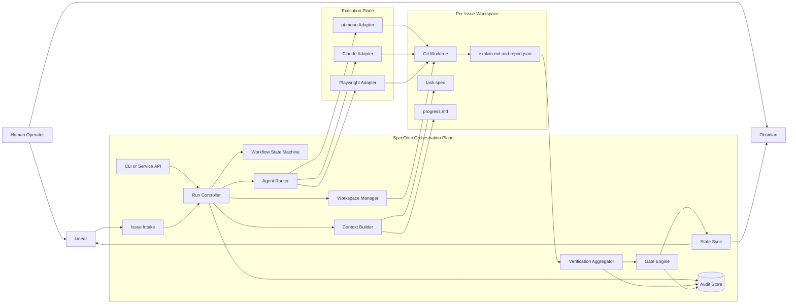
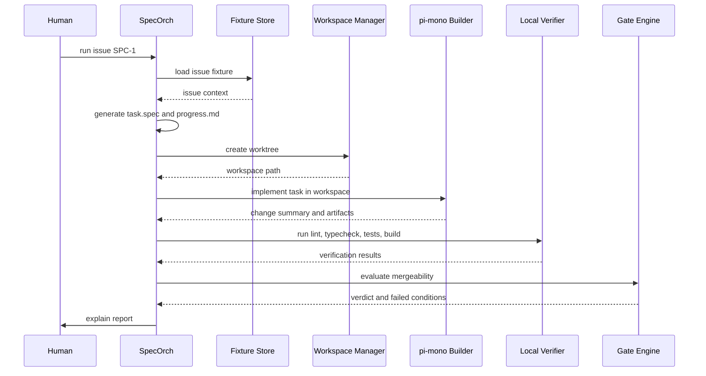

# Orchestration Plane Options and MVP Dogfooding

## 1. Goal

This document narrows the orchestration choice for SpecOrch and defines the fastest path to a runnable prototype that can start developing SpecOrch with SpecOrch.

The target is not a polished platform. The target is a minimal loop that can:

1. take one local issue fixture
2. create one isolated workspace
3. generate `task.spec` and `progress.md`
4. invoke a builder runtime
5. run basic verification
6. produce a gate verdict
7. record the run for later review

Once that loop exists, the project should switch into dogfooding mode and use the loop to implement the next slices of the system.

## 2. Selection Principle

The orchestration layer is responsible for:

- issue lifecycle and state transitions
- workspace creation and cleanup
- adapter routing
- retries, timeouts, and escalation
- aggregation of verification, review, and preview results
- gate evaluation
- auditability and replay

That means the orchestration plane should be selected primarily on workflow control, resumability, and integration ergonomics, not on prompt quality or agent UX.

## 3. Candidate Options

### 3.1 Python Self-Managed Daemon

Description:

- a Python service or CLI owns the run controller, state machine, workspace manager, adapter routing, and gate engine
- external tools such as `pi-mono`, `Claude`, and `Playwright` are treated as adapters behind subprocess or RPC boundaries

Strengths:

- lowest path to first runnable loop
- perfect fit for SpecOrch's issue and artifact model
- no external workflow platform required
- easy to keep `task.spec`, `progress.md`, and audit artifacts as first-class objects

Weaknesses:

- durability, backoff, queueing, and operations tooling start out minimal
- long-running and resumable flows need to be implemented explicitly

Fit:

- best option for v1 MVP

### 3.2 Python Daemon with `pi-mono` as Agent Runtime

Description:

- same Python control plane as above
- `pi-mono` is used as the builder or reviewer runtime through CLI or RPC

Strengths:

- keeps workflow ownership in SpecOrch
- allows swapping agent providers without rewriting the orchestrator
- lets SpecOrch benefit from `pi-mono`'s agent loop and coding workflow without making it the source of truth

Weaknesses:

- adds a dual-runtime boundary between Python and Node
- requires a careful contract for prompts, artifacts, and structured outputs

Fit:

- recommended v1 execution strategy

### 3.3 Prefect

Description:

- Prefect runs flows and tasks with retry, scheduling, state tracking, and deployment support

Strengths:

- Python-native and operationally lighter than Temporal
- good fit for retries, pause points, and observable runs
- useful if SpecOrch grows into a service running many queued issues

Weaknesses:

- adds another platform and deployment model early
- the core value of SpecOrch is still domain-specific orchestration, so Prefect does not remove much domain logic

Fit:

- strong v1.5 or v2 option if run durability and operability become painful

### 3.4 Temporal

Description:

- Temporal provides durable execution and workflow history with Python SDK support

Strengths:

- strongest durability and replay model
- ideal for long-running workflows with approvals, retries, and external waits
- good eventual fit if SpecOrch becomes multi-runner and team-facing

Weaknesses:

- highest complexity cost
- workflow determinism and activity boundaries require discipline
- too heavy for the fastest possible prototype

Fit:

- excellent long-term candidate, poor first-prototype choice

### 3.5 LangGraph

Description:

- graph-driven, stateful orchestration for long-running agents

Strengths:

- strong for agentic branching, checkpoints, and human-in-the-loop
- good if SpecOrch evolves toward a graph of planners, reviewers, and verifiers

Weaknesses:

- better for agent workflow graphs than for repository and workspace control
- still leaves a lot of issue-state, audit, and gate semantics outside the graph

Fit:

- useful if agent-to-agent routing becomes the dominant complexity

## 4. Decision Matrix

| Option | Time to MVP | Python Fit | Durable Runs | Worktree Control | Human Approval Modeling | Operational Weight | Recommendation |
|--------|-------------|------------|--------------|------------------|-------------------------|--------------------|----------------|
| Python daemon | High | High | Low | High | Medium | Low | Use as base |
| Python + `pi-mono` | High | Medium | Low | High | Medium | Medium | Use for v1 |
| Prefect | Medium | High | Medium | Medium | Medium | Medium | Consider next |
| Temporal | Low | Medium | High | Medium | High | High | Later |
| LangGraph | Medium | Medium | Medium | Low | Medium | Medium | Niche |

## 5. Recommendation

### 5.1 Recommended v1 Shape

Use:

- Python for the orchestration plane
- `pi-mono` for builder and reviewer execution
- `Playwright` for browser verification
- local filesystem artifacts plus SQLite for audit state
- git worktrees for per-issue isolation

This gives SpecOrch the fastest path to a working loop while preserving a clean future migration path. The orchestrator stays in control of state, boundaries, and mergeability. Agents remain pluggable executors.

### 5.2 Why `pi-mono` Is Not the Whole Orchestration Layer

`pi-mono` is a strong candidate for the execution runtime, but it should not own:

- Linear state transitions
- the authoritative issue lifecycle
- worktree leasing and cleanup
- gate evaluation
- mergeability policy
- audit storage

If those concerns live inside an agent session, the system will lose the single-source-of-truth properties that the SpecOrch design depends on.

## 6. `pi-mono` Integration Strategy

### 6.1 Integration Options

Option A: Shell out to CLI

- easiest start
- Python calls `pi` with a structured prompt bundle and output path
- good for the first spike

Option B: RPC sidecar

- recommended follow-up
- a long-lived `pi` process or thin Node wrapper accepts structured requests from Python
- lowers startup overhead and makes the adapter contract cleaner

Option C: Full Node-side orchestration

- not recommended for v1
- would split orchestration truth across runtimes too early

### 6.2 Integration Difficulty

Estimated difficulty:

- CLI integration: low
- RPC integration: medium
- deep SDK embedding into Python-owned business logic: high

The practical conclusion is simple: treat `pi-mono` as an external execution engine, not as a Python library.

## 7. MVP Prototype Definition

The first runnable prototype should support one local happy path:

1. load a fixture issue from disk
2. draft `task.spec`
3. create a git worktree
4. invoke builder adapter in the worktree
5. run `lint`, `typecheck`, `test`, and `build` through a local verifier
6. compute a gate verdict
7. write `explain.md` and `report.json`

Not required in the first prototype:

- real Linear integration
- real PR comments
- remote preview deployment
- concurrent issue execution
- full retry scheduler

## 8. Dogfooding Strategy

Dogfooding should start immediately after the first happy-path prototype exists.

### 8.1 Rule

Every next meaningful task in this repository should be represented as a SpecOrch issue fixture and attempted through SpecOrch first.

### 8.2 Allowed Escape Hatches

Humans may bypass SpecOrch only when:

- bootstrapping missing core capabilities
- fixing a broken orchestrator path that prevents self-hosting
- handling secrets or environment setup not yet modeled

### 8.3 Dogfood Milestones

#### Milestone 0: Manual bootstrap

- humans create docs and scaffold code directly

#### Milestone 1: Local single-issue runner

- SpecOrch can run one fixture issue end to end on the local machine

#### Milestone 2: Self-hosted implementation queue

- new internal tasks are created as issue fixtures
- SpecOrch executes them in local worktrees
- humans review explain reports and accept or reject

#### Milestone 3: Real control-plane integration

- replace local issue fixtures with Linear-backed issues
- replace local acceptance notes with structured write-back

## 9. High-Level Component Architecture

## 10. MVP Runtime Sequence

## 11. Suggested Build Order

1. Build a local CLI that runs one fixture issue.
2. Add worktree creation and artifact generation.
3. Add a `pi-mono` builder adapter that writes structured output files.
4. Add local verification and gate evaluation.
5. Start using issue fixtures in this repo for subsequent tasks.
6. Only then add real `Linear` and `Obsidian` integrations.

## 12. Practical Recommendation

Do not spend the next iteration deciding between orchestration frameworks in the abstract.

Instead:

1. implement the Python orchestrator skeleton now
2. integrate `pi-mono` through the thinnest viable adapter
3. prove one local end-to-end issue run
4. switch the repo into dogfooding mode
5. revisit Prefect or Temporal only when real pain appears around resume, retries, or multi-run concurrency

That path is the shortest route from design to evidence.

## 13. Reference Signals

These references informed the recommendation:

- `pi-mono` repository and package docs for agent runtime capabilities
- `Prefect` documentation for Python-native flow orchestration and state handling
- `Temporal` documentation for durable execution and workflow modeling
- `LangGraph` overview for stateful long-running agent graphs
