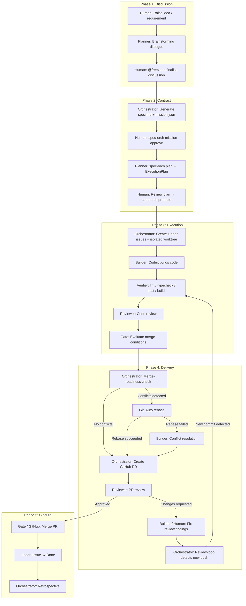
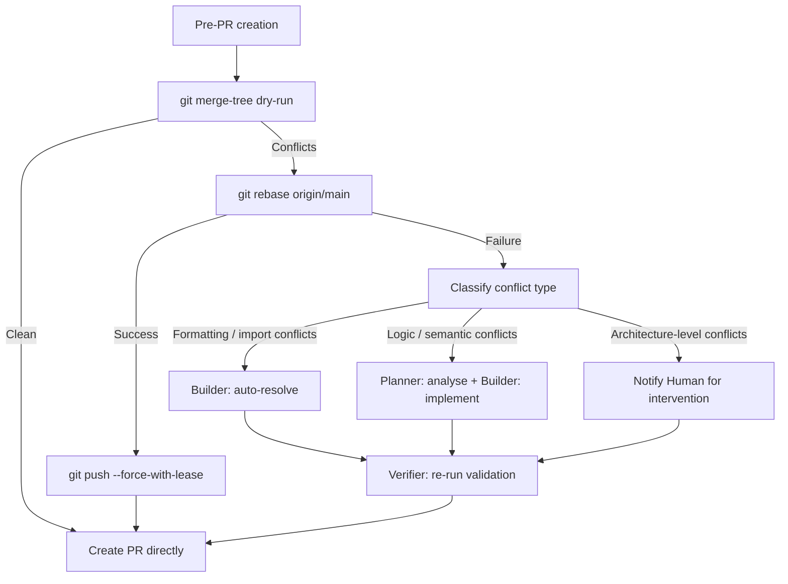
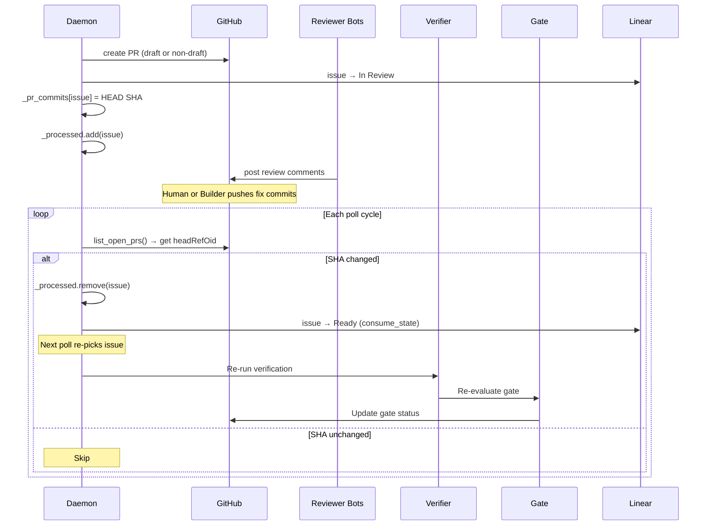

# SpecOrch Pipeline: Stages, Roles, and Responsibilities

## Role Definitions

| Role | Identity | Tools / Implementation |
|------|----------|----------------------|
| **Human** | User / product owner | Linear UI, CLI, Slack |
| **Planner** | LLM-based solution designer | LiteLLM (MiniMax M2.5, etc.) |
| **Orchestrator** | Pipeline coordinator (daemon / CLI) | `spec-orch` daemon + RunController |
| **Builder** | Code generation executor | Codex / Claude Code |
| **Verifier** | Automated validation runner | lint, typecheck, test, build (subprocess) |
| **Reviewer** | Code review engine | GitHub review bots (Devin, Gemini, CodeRabbit, Codex) |
| **Gate** | Merge-readiness evaluator | GateService + GatePolicy |
| **Git/GitHub** | Version control + PR platform | git CLI, gh CLI |
| **Linear** | Task control plane | Linear GraphQL API |

## End-to-End Pipeline

## Stage Details

### Phase 1: Discussion

| Step | Primary Role | Input | Output | Options |
|------|-------------|-------|--------|---------|
| Raise requirement | **Human** | Idea / problem | Natural language description | CLI TUI / Slack / Linear comment |
| Brainstorm | **Planner** | Conversation history | Solution exploration | `spec-orch discuss` |
| Freeze discussion | **Human** | `@freeze` command | spec.md draft + mission.json | In-session command |

### Phase 2: Contract

| Step | Primary Role | Input | Output | Options |
|------|-------------|-------|--------|---------|
| Approve spec | **Human** | spec.md | mission.json.approved_at | `spec-orch mission approve` |
| Generate execution plan | **Planner** | spec.md + codebase | plan.json (waves + packets) | `spec-orch plan` |
| Promote to Linear | **Orchestrator** | plan.json | Linear issues (one per packet) | `spec-orch promote` |

### Phase 3: Execution

| Step | Primary Role | Input | Output | Options |
|------|-------------|-------|--------|---------|
| Readiness assessment | **Orchestrator** | Issue description | ready / needs-clarification | ReadinessChecker (rules + LLM) |
| Code build | **Builder** | spec + issue prompt | Code changes | Codex CLI (`codex exec`) |
| Automated verification | **Verifier** | Workspace code | lint / test / build results | subprocess execution |
| Automated review | **Reviewer** | PR diff | Review verdict + findings | LocalReviewAdapter / GitHubReviewAdapter |
| Gate evaluation | **Gate** | All conditions | mergeable / blocked | GatePolicy + profiles |

### Phase 4: Delivery

| Step | Primary Role | Input | Output | Failure Handling |
|------|-------------|-------|--------|-----------------|
| Merge check | **Git** | branch vs main | conflict / clean | `git merge-tree` dry-run |
| Auto rebase | **Git** | branch + main | rebased branch | `git rebase` + `--force-with-lease` |
| Conflict resolution | **Builder** *(not yet implemented)* | conflict markers | resolved code | Codex executes resolve task |
| Create PR | **Orchestrator** | workspace | GitHub PR URL | `gh pr create` |
| PR review | **Reviewer** | PR diff | review comments | Devin / Gemini / CodeRabbit / Codex bots |
| Fix review findings | **Human** or **Builder** | review comments | new commits | manual or automated |
| Review loop | **Orchestrator** | PR headRefOid | re-run verify + gate | daemon polls for new commits |

### Phase 5: Closure

| Step | Primary Role | Input | Output | Trigger |
|------|-------------|-------|--------|---------|
| Merge PR | **Gate** + **GitHub** | gate pass | merged code | auto-merge or manual |
| Close issue | **Linear** | PR merged | issue → Done | Linear-GitHub App |
| Retrospective | **Orchestrator** | run artifacts | retrospective.md | `spec-orch retro` |

## Conflict Resolution Decision Tree

**Current implementation status:**

| Capability | Status |
|-----------|--------|
| `git merge-tree` dry-run | Implemented |
| `git rebase` | Implemented |
| Classify conflict type after rebase failure | **Not implemented** (current: create PR with warning) |
| Builder auto-resolve | **Not implemented** |
| Planner-assisted resolve | **Not implemented** |
| Human escalation | **Not implemented** |

## Review-Fix Loop Sequence

