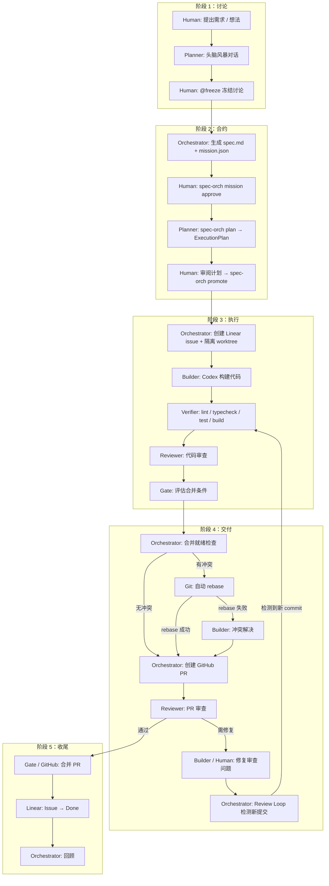
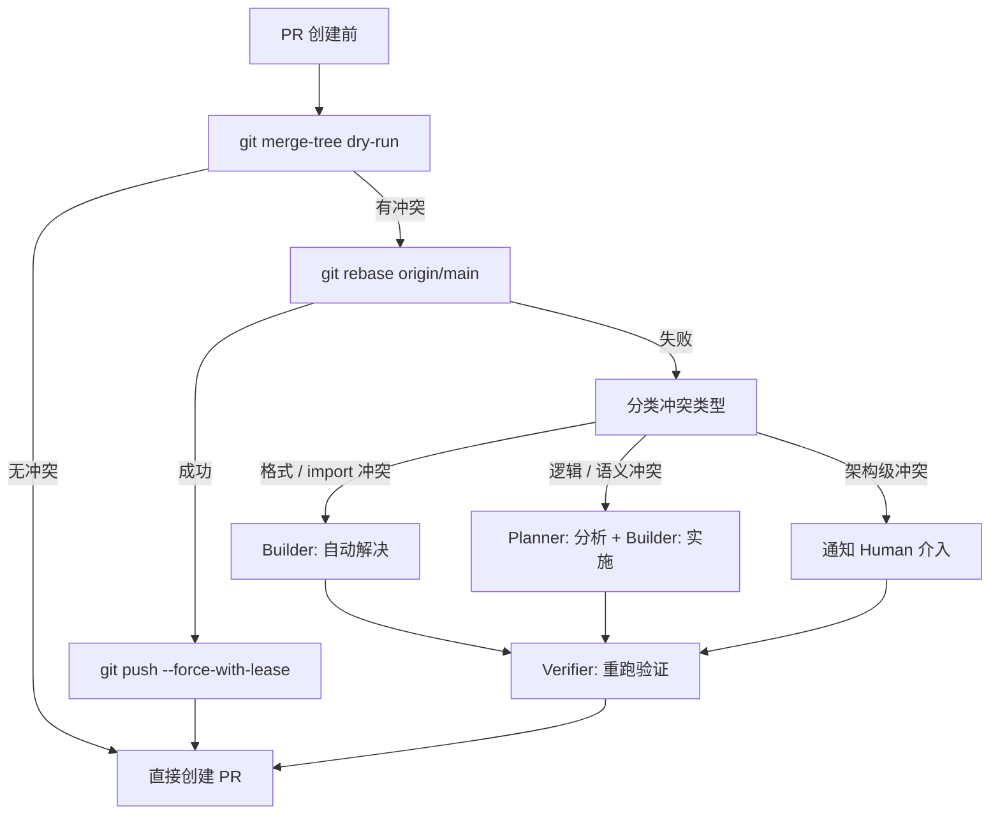
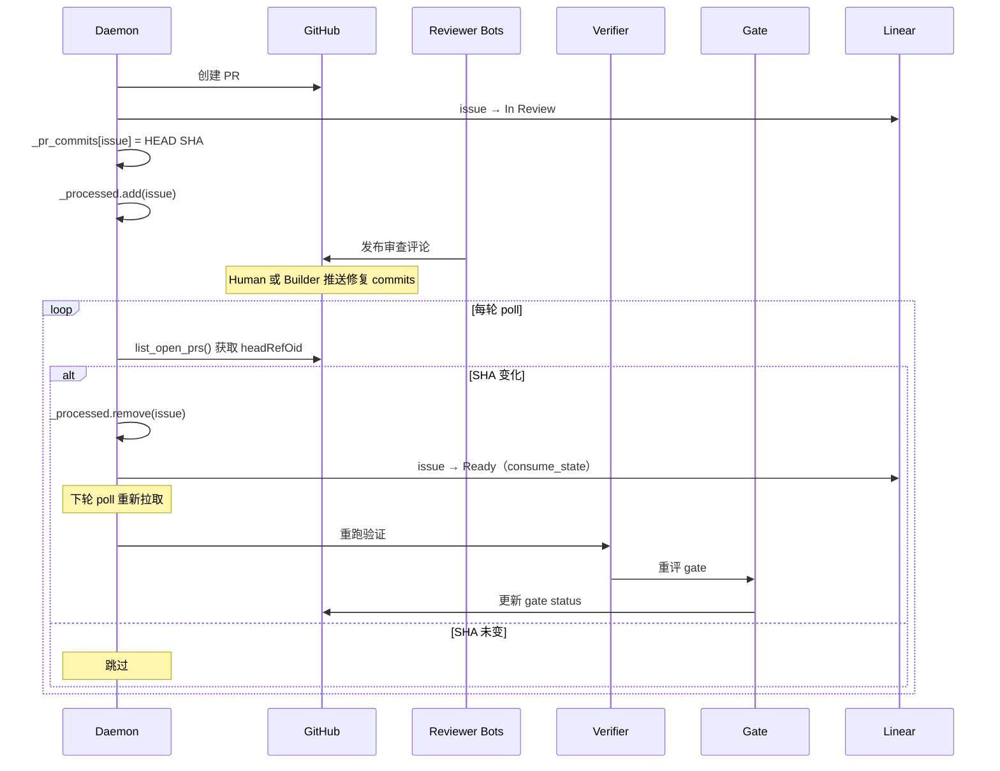

# SpecOrch 全流程：阶段、角色与职责

> 本文档是 [pipeline-roles-and-stages.md](pipeline-roles-and-stages.md) 的中文翻译。以英文版为准。

> **相关文档：** 并非所有变更都需要完整流水线。参见
> [变更管理策略](change-management-policy.md) 了解三级模型
>（Full / Standard / Hotfix）。

## 角色定义

| 角色 | 身份 | 工具 / 实现 |
|------|------|------------|
| **Human** | 用户 / 产品负责人 | Linear UI, CLI, Slack |
| **Planner** | LLM 方案规划器 | LiteLLM (MiniMax M2.5 等) |
| **Orchestrator** | 流程编排器（daemon / CLI） | `spec-orch` daemon + RunController |
| **Builder** | 代码生成执行器 | Codex / Claude Code |
| **Verifier** | 自动化验证器 | lint, typecheck, test, build (subprocess) |
| **Reviewer** | 代码审查器 | GitHub review bots (Devin, Gemini, CodeRabbit, Codex) |
| **Gate** | 合并判定引擎 | GateService + GatePolicy |
| **Git/GitHub** | 版本控制 + PR 平台 | git CLI, gh CLI |
| **Linear** | 任务控制平面 | Linear GraphQL API |

## 端到端流程图

## 各阶段详解

### 阶段 1：讨论（Discussion）

| 步骤 | 核心角色 | 输入 | 输出 | 可选项 |
|------|---------|------|------|--------|
| 提出需求 | **Human** | 想法 / 问题 | 自然语言描述 | CLI TUI / Slack / Linear comment |
| 头脑风暴 | **Planner** | 对话历史 | 方案探讨 | `spec-orch discuss` |
| 冻结讨论 | **Human** | `@freeze` 指令 | spec.md 草稿 + mission.json | 会话内命令 |

### 阶段 2：合约（Contract）

| 步骤 | 核心角色 | 输入 | 输出 | 可选项 |
|------|---------|------|------|--------|
| 审批 Spec | **Human** | spec.md | mission.json.approved_at | `spec-orch mission approve` |
| 生成执行计划 | **Planner** | spec.md + 代码库 | plan.json（waves + packets） | `spec-orch plan` |
| 提升到 Linear | **Orchestrator** | plan.json | Linear issues（每 packet 一个） | `spec-orch promote` |

### 阶段 3：执行（Execution）

| 步骤 | 核心角色 | 输入 | 输出 | 可选项 |
|------|---------|------|------|--------|
| 就绪评估 | **Orchestrator** | issue 描述 | ready / needs-clarification | ReadinessChecker（规则 + LLM） |
| 代码构建 | **Builder** | spec + issue prompt | 代码变更 | Codex CLI (`codex exec`) |
| 自动验证 | **Verifier** | 工作区代码 | lint / test / build 结果 | subprocess 执行 |
| 自动审查 | **Reviewer** | PR diff | 审查意见 + 结论 | LocalReviewAdapter / GitHubReviewAdapter |
| Gate 评估 | **Gate** | 所有条件 | mergeable / blocked | GatePolicy + profiles |

### 阶段 4：交付（Delivery）

| 步骤 | 核心角色 | 输入 | 输出 | 失败处理 |
|------|---------|------|------|----------|
| 合并检查 | **Git** | branch vs main | 有冲突 / 无冲突 | `git merge-tree` dry-run |
| 自动 Rebase | **Git** | branch + main | rebased branch | `git rebase` + `--force-with-lease` |
| 冲突解决 | **Builder** *（未实现）* | conflict markers | 解决后的代码 | Codex 执行 resolve task |
| 创建 PR | **Orchestrator** | workspace | GitHub PR URL | `gh pr create` |
| PR 审查 | **Reviewer** | PR diff | 审查评论 | Devin / Gemini / CodeRabbit / Codex bots |
| 修复审查问题 | **Human** 或 **Builder** | 审查评论 | 新 commits | 手动或自动 |
| Review Loop | **Orchestrator** | PR headRefOid | 重跑 verify + gate | daemon 轮询检测 |

### 阶段 5：收尾（Closure）

| 步骤 | 核心角色 | 输入 | 输出 | 触发方式 |
|------|---------|------|------|----------|
| 合并 PR | **Gate** + **GitHub** | gate pass | 已合并代码 | auto-merge 或手动 |
| 关闭 Issue | **Linear** | PR merged | issue → Done | Linear-GitHub App 自动 |
| 回顾 | **Orchestrator** | run artifacts | retrospective.md | `spec-orch retro` |

## 冲突解决决策树

**当前实现状态：**

| 能力 | 状态 |
|-----|------|
| `git merge-tree` dry-run | 已实现 |
| `git rebase` | 已实现 |
| rebase 失败后分类冲突类型 | **未实现**（当前行为：带警告创建 PR） |
| Builder 自动解决 | **未实现** |
| Planner 辅助解决 | **未实现** |
| Human 上报 | **未实现** |

## Review-Fix Loop 序列图

