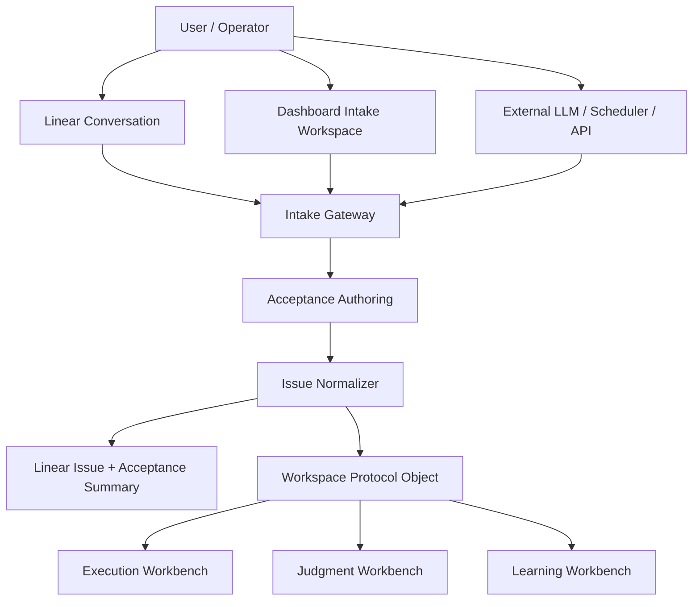
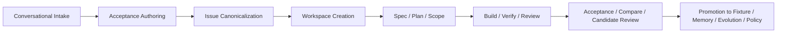
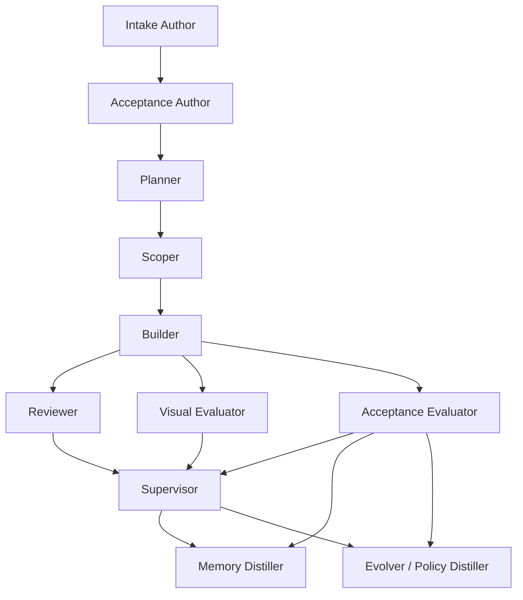
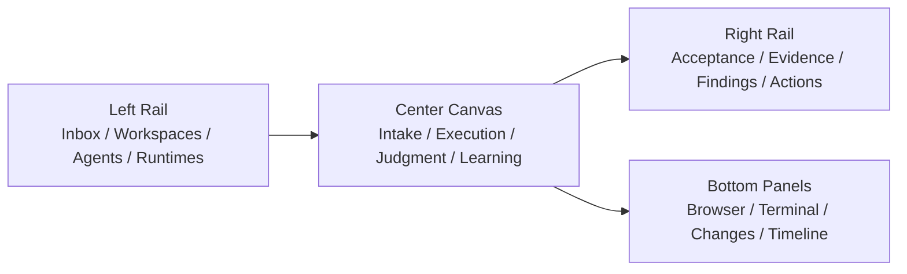
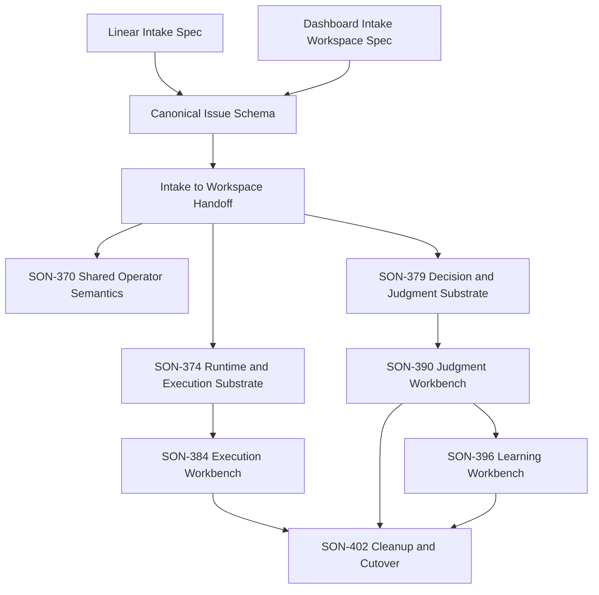

# Conversational Intake and Workflow Overview

> **Date:** 2026-04-01
> **Status:** draft v0
> **Purpose:** define where user intent enters SpecOrch, how acceptance is
> authored, how that intent becomes canonical work, and how operators debug and
> observe the full workflow end to end

## 1. Why This Document Exists

SpecOrch has already gone deep on:

- execution
- judgment
- learning

But the system is still weak at the very front of the lifecycle:

- where requirements enter
- where acceptance is authored
- where the canonical issue is formed
- where the operator can see how intent became execution

Today the real workflow is often:

1. discuss the work in chat
2. write or refine local planning docs
3. update Linear later

That makes Linear feel like a synchronized ledger instead of the source of
truth.

This document defines the missing front layer:

**Conversational Intake and Acceptance Authoring**

It also shows how that intake layer connects to the existing workbench design:

- `Execution Workbench`
- `Judgment Workbench`
- `Learning Workbench`

## 2. Core Design Decision

### 2.1 Recommended model

SpecOrch should support **multiple conversational entry points**, but only
**one canonical intake pipeline**.

That means:

- users may start the conversation in multiple places
- the system must normalize that conversation into one canonical issue /
  acceptance object
- after normalization, all downstream work consumes the same canonical object

### 2.2 The recommended source-of-truth rule

The right rule is not:

- `Linear is the only place a human may ever speak`

The right rule is:

- **all accepted work must canonicalize into Linear + Workspace Protocol state**

More precisely:

- `Linear` should be the canonical system of record for the issue and its
  operator-readable acceptance summary
- `Workspace` should be the canonical runtime container for execution,
  evidence, judgment, and learning state

So the system becomes:

- **many entry points**
- **one normalized issue**
- **one workspace lineage**

## 3. Entry Point Options

SpecOrch should support three primary entry points.

### 3.1 Linear-native conversation

The user starts in Linear:

- issue description
- issue comments
- issue refinement thread
- acceptance authoring prompts

Use this when:

- the work begins as product/project work
- the operator wants the issue system to remain the visible source of truth
- the team wants minimal context switching

### 3.2 Dashboard-native conversation

The user starts in the Dashboard:

- mission launcher
- intake workspace
- acceptance authoring surface
- issue-draft wizard backed by conversation

Use this when:

- the operator needs richer runtime context
- the work is tightly connected to existing missions, evidence, or system state
- the operator needs a stronger authoring UI than raw issue comments

### 3.3 External LLM / scheduler / API entry

The user starts outside both Linear and the Dashboard:

- API
- CLI
- orchestrator
- external LLM agent

Use this when:

- work is programmatically generated
- another system proposes the issue
- a conversational agent acts as the intake author

### 3.4 Recommendation

All three should exist.

But they must all feed one common layer:

- `Intake Gateway`
- `Acceptance Authoring`
- `Issue Normalization`
- `Linear writeback`
- `Workspace creation`

So the product rule becomes:

- **origin may vary**
- **canonicalization may not**

## 4. High-Level System Overview

## 5. End-to-End Workflow

### 5.1 Narrative flow

The intended lifecycle should be:

1. a user starts from Linear, Dashboard, or external API
2. the intake layer turns that into a structured problem statement
3. the system clarifies acceptance through dialogue
4. the canonical issue is written to Linear
5. a workspace is created
6. execution runs inside the workspace
7. judgment evaluates evidence
8. learning promotes reviewed outcomes
9. Linear and the Dashboard remain consistent views over the same work

### 5.2 Workflow graph

## 6. Canonical Objects

The intake and workflow system should revolve around these canonical objects.

### 6.1 Intake Draft

Temporary conversational object before canonical issue creation.

Required fields:

- `origin`
- `raw_request`
- `current_problem_statement`
- `open_questions`
- `acceptance_draft`
- `constraints`
- `authoring_state`

### 6.2 Canonical Issue

The durable work object written to Linear.

Required fields:

- `problem`
- `goal`
- `constraints`
- `acceptance`
- `evidence_expectations`
- `open_questions`
- `current_plan`

### 6.3 Workspace

The runtime container from [2026-04-01-workspace-protocol-spec.md](./2026-04-01-workspace-protocol-spec.md).

It binds:

- issue
- execution
- evidence
- judgment
- learning

### 6.4 Acceptance Summary

This should become a first-class issue section, not an afterthought.

Minimum shape:

- `what success looks like`
- `how we will verify it`
- `which routes / surfaces matter`
- `what counts as failure`
- `what still needs human judgment`

## 7. Internal LLM Decision and Dialogue Nodes

The system already contains many internal LLM-driven or LLM-adjacent nodes.
They should be explicitly modeled, not treated as invisible service calls.

## 7.1 Node taxonomy

| Node | Current / partial owner | Main role | Can talk to user directly? | Future plane |
|------|--------------------------|-----------|-----------------------------|--------------|
| Intake Author | not first-class yet; should sit above `dashboard/launcher.py` and `services/linear_client.py` | turns raw request into structured issue draft | yes | intake |
| Acceptance Author | not first-class yet; should sit above `spec_snapshot_service.py` and acceptance planning | turns intent into acceptance contract | yes | intake / judgment |
| Planner | `PlannerAdapter`, `spec_snapshot_service.py`, `RunController` | spec drafting, unresolved question generation | yes | intake / planning |
| Scoper | `ScoperAdapter`, mission planning flow | turns mission/spec into work packets | operator-visible recap, usually not direct chat | execution |
| Builder / Implementor | `BuilderAdapter`, `services/builders/*` | implementation work | sometimes | execution |
| Supervisor | `round_orchestrator.py` + supervisor adapter | round review and next-step decisions | yes, through review rationale / ask-human | judgment |
| Acceptance Evaluator | `services/acceptance/*`, `round_orchestrator.py` | workflow / exploratory evaluation | yes, through judgment surfaces | judgment |
| Visual Evaluator | visual evaluation adapters | UI/visual evidence review | usually indirect | judgment |
| Reviewer | `review_adapter.py`, gate-related review path | code/review semantics | sometimes | judgment |
| Memory Distiller | `services/memory/*` | promote reviewed knowledge to memory | no raw chat, but operator-visible explanation | learning |
| Evolver / Policy Distiller | `services/evolution/*` | synthesize durable changes from reviewed outcomes | no raw chat, but operator-visible proposal surface | learning |

## 7.2 Node graph

## 8. Recommended Product Model

### 8.1 The key distinction

We should separate:

- **conversation origin**
- **canonical issue state**
- **workspace runtime state**

Those three are related, but they are not the same thing.

### 8.2 Recommended rule set

1. **Users may start anywhere**
   - Linear
   - Dashboard
   - external API / LLM

2. **The system must always canonicalize**
   - every accepted request becomes a canonical issue shape

3. **Linear remains the issue record**
   - titles
   - problem statement
   - acceptance summary
   - operator-visible status

4. **Workspace remains the runtime record**
   - execution
   - evidence
   - judgment
   - learning

5. **The Dashboard becomes the richest control surface**
   - not the only source
   - but the best place to understand what the system is doing

### 8.3 Recommendation on “where should the conversation happen?”

The answer should be:

- **support conversation in multiple places**
- **make Linear canonical for issue truth**
- **make Dashboard canonical for runtime truth**

That gives the best of both worlds:

- `Linear` stays the durable planning and issue source of truth
- `Dashboard` becomes the best operator surface
- external LLM-driven intake remains possible

## 9. Mapping to Current Code Structure

This section defines how the current codebase should converge toward the target
model.

## 9.1 Intake layer

This is mostly missing as a first-class layer today.

Current partial owners:

- [launcher.py](/Users/chris/.superset/worktrees/spec-orch/codexharness/src/spec_orch/dashboard/launcher.py)
- [api.py](/Users/chris/.superset/worktrees/spec-orch/codexharness/src/spec_orch/dashboard/api.py)
- [linear_client.py](/Users/chris/.superset/worktrees/spec-orch/codexharness/src/spec_orch/services/linear_client.py)
- [spec_snapshot_service.py](/Users/chris/.superset/worktrees/spec-orch/codexharness/src/spec_orch/services/spec_snapshot_service.py)

Recommended destination:

- create a new `intake` or `authoring` layer that owns:
  - issue draft creation
  - acceptance authoring
  - unresolved question tracking
  - canonical issue normalization
  - writeback to Linear

### 9.2 Execution substrate

Current owners:

- [run_controller.py](/Users/chris/.superset/worktrees/spec-orch/codexharness/src/spec_orch/services/run_controller.py)
- [mission_execution_service.py](/Users/chris/.superset/worktrees/spec-orch/codexharness/src/spec_orch/services/mission_execution_service.py)
- `services/builders/*`
- `services/workers/*`

Recommended destination:

- keep execution truth in runtime-owned modules
- move only view logic into the Dashboard

### 9.3 Judgment substrate

Current owners:

- [round_orchestrator.py](/Users/chris/.superset/worktrees/spec-orch/codexharness/src/spec_orch/services/round_orchestrator.py)
- `services/acceptance/*`
- `review_adapter.py`

Recommended destination:

- keep routing, evidence ownership, candidate-finding semantics, and review
  state here
- do not let dashboard pages invent separate judgment state

### 9.4 Learning substrate

Current owners:

- `services/memory/*`
- `services/evolution/*`

Recommended destination:

- only reviewed outputs should promote into these systems
- raw runtime events should never become durable learning directly

### 9.5 Dashboard

Current owners:

- [app.py](/Users/chris/.superset/worktrees/spec-orch/codexharness/src/spec_orch/dashboard/app.py)
- [shell.py](/Users/chris/.superset/worktrees/spec-orch/codexharness/src/spec_orch/dashboard/shell.py)
- [missions.py](/Users/chris/.superset/worktrees/spec-orch/codexharness/src/spec_orch/dashboard/missions.py)
- [launcher.py](/Users/chris/.superset/worktrees/spec-orch/codexharness/src/spec_orch/dashboard/launcher.py)
- [surfaces.py](/Users/chris/.superset/worktrees/spec-orch/codexharness/src/spec_orch/dashboard/surfaces.py)
- [transcript.py](/Users/chris/.superset/worktrees/spec-orch/codexharness/src/spec_orch/dashboard/transcript.py)

Recommended destination:

- the dashboard should become the best operator surface
- but should consume canonical intake, execution, judgment, and learning seams
  instead of owning private truth

## 10. User-Visible UX Requirements

The user should be able to understand, from the interface alone:

1. where this piece of work came from
2. what acceptance was agreed
3. what is currently running
4. what the system currently believes
5. what happens next

## 10.1 Recommended UI Shell

The target UI should not be a chat page plus a few detail tabs.

It should be one operator shell with four visible regions:

1. `Left rail`
   - inbox
   - workspaces
   - active work
   - agents
   - runtimes

2. `Center workspace canvas`
   - intake authoring when work is being defined
   - execution overview while work is running
   - evidence / judgment / learning drilldown when work is under review

3. `Right detail rail`
   - current acceptance summary
   - current evidence bundle summary
   - current candidate findings
   - intervention actions

4. `Bottom or secondary panel stack`
   - browser
   - terminal
   - changes
   - timeline

The key UX rule is:

- the user should not need to bounce across unrelated pages to understand what
  the system is doing
- the main workspace should remain stable while the center canvas changes by
  mode:
  - `authoring`
  - `running`
  - `reviewing`
  - `learning`

### 10.2 Intake UX

The intake experience should clearly show:

- current problem statement
- current goal
- current open questions
- current acceptance draft
- what is still unresolved before the issue becomes canonical

### 10.3 Execution UX

The execution experience should clearly show:

- active agent
- active runtime
- current phase
- last meaningful event
- intervention options

### 10.4 Judgment UX

The judgment experience should clearly show:

- evaluated scope
- evidence used
- judgment class
- reason text
- candidate findings
- compare drift

### 10.5 Learning UX

The learning experience should clearly show:

- what was promoted
- why it was promoted
- what it became
- whether it was rolled back or retired

## 11. Debugging and Troubleshooting Model

This system should be debuggable from the same layered model.

### 11.1 If intake is wrong

Check:

- intake draft
- unresolved question log
- acceptance authoring transcript
- Linear writeback payload

Typical failure:

- issue got canonicalized before acceptance was clear

### 11.2 If execution is confusing

Check:

- active execution session
- runtime health
- event trail
- browser / terminal surfaces
- intervention history

Typical failure:

- the work is running, but the operator cannot tell who owns it or why it is
  stalled

### 11.3 If judgment feels wrong

Check:

- base run mode
- evidence bundle
- compare overlay
- judgment timeline
- candidate-finding review state

Typical failure:

- a warn/fail judgment exists without legible evidence provenance

### 11.4 If learning seems noisy

Check:

- reviewed judgment origin
- promotion lineage
- fixture registry
- memory linkage
- rollback history

Typical failure:

- raw runtime noise was treated like durable learning

## 12. Operator Observability Matrix

| Question | Primary surface | Backing owner |
|----------|-----------------|---------------|
| Where did this request come from? | Intake / Workspace header | intake layer |
| What was the agreed acceptance? | Intake / Judgment overview | intake + judgment |
| What is running right now? | Execution Workbench | runtime |
| Why is it blocked or degraded? | Execution timeline / runtime detail | runtime |
| What evidence was collected? | Evidence bundle | judgment |
| Why did the system conclude this? | Judgment timeline | judgment |
| What became durable learning? | Learning timeline | learning |
| What should I inspect when something is wrong? | Workspace drilldown + timelines | all three planes |

## 13. Comparison With Intent and Multica

## 13.1 Intent

Intent is strongest at:

- workspace protocol
- specialist protocol
- browser / terminal / changes as first-class panels
- execution-side productization

SpecOrch should borrow:

- workspace-driven UX
- visible role objects
- panelized runtime tools
- task/spec/agent coordination discipline

SpecOrch should not collapse into:

- an IDE-first shell
- an execution-only shell

SpecOrch must add:

- acceptance authoring
- judgment workbench
- candidate-finding lifecycle
- learning promotion lineage

### 13.2 Multica

Multica is strongest at:

- agent roster visibility
- runtime roster visibility
- issue execution visibility
- daemon / task / claim / progress management

SpecOrch should borrow:

- runtime service observability
- agent-as-worker visibility
- live task state UX

SpecOrch should not collapse into:

- a control plane with weak judgment semantics

SpecOrch must add:

- evidence-first acceptance
- compare overlay
- candidate review
- memory/evolution promotion

### 13.3 The target UX difference

| Product | Strongest current feeling | Weakest current feeling |
|---------|---------------------------|-------------------------|
| Intent | sophisticated agent workspace | weak public evidence/judgment model |
| Multica | agent-native execution control plane | weak acceptance / learning layer |
| SpecOrch target | execution + judgment + learning operator workbench | should avoid becoming chat-first or page-fragmented |

## 14. Relationship to the Current 7-Epic Program

This document does not replace the 7-Epic structure.

It explains what sits in front of it and what ties it together.

### The missing pre-layer

Before:

- `Execution Workbench`
- `Judgment Workbench`
- `Learning Workbench`

there is now an explicit front layer:

- `Conversational Intake and Acceptance Authoring`

### Practical implication

The 7-Epic program should be read as:

1. `Shared Operator Semantics`
2. `Runtime and Execution Substrate`
3. `Decision and Judgment Substrate`
4. `Execution Workbench`
5. `Judgment Workbench`
6. `Learning Workbench`
7. `Surface Cleanup and Cutover`

And this document adds the upstream rule:

- **all accepted work should enter those seven epics through a normalized
  conversational intake flow**

## 15. Recommended Next Docs

If this design is accepted, the next docs to write should be:

1. `Linear Intake and Acceptance Authoring Spec`
2. `Dashboard Intake Workspace Spec`
3. `Canonical Issue and Acceptance Schema`
4. `Intake-to-Workspace Handoff Contract`

## 15.1 How These Docs Chain Into the 7-Epic Program

These four docs are not separate from the existing workbench architecture.
They are the front-door layer that explains how work enters it.

### Upstream intake docs

1. [2026-04-01-linear-intake-and-acceptance-authoring-spec.md](./2026-04-01-linear-intake-and-acceptance-authoring-spec.md)
   - defines how Linear becomes a true conversational intake surface
2. [2026-04-01-dashboard-intake-workspace-spec.md](./2026-04-01-dashboard-intake-workspace-spec.md)
   - defines the richer dashboard-native authoring surface
3. [2026-04-01-canonical-issue-and-acceptance-schema.md](./2026-04-01-canonical-issue-and-acceptance-schema.md)
   - defines the common normalized issue object
4. [2026-04-01-intake-to-workspace-handoff-contract.md](./2026-04-01-intake-to-workspace-handoff-contract.md)
   - defines the seam that hands normalized work into the workbench system

### How they feed the 7 epics

### Practical reading order

1. read this overview
2. read the canonical issue schema
3. read the handoff contract
4. read the Linear and Dashboard intake specs
5. then continue into:
   - workspace protocol
   - execution workbench
   - judgment workbench
   - learning workbench

## 16. Final Judgment

The system should not force a false choice between:

- `Linear-only conversation`
- `Dashboard-only conversation`
- `external-LLM-only conversation`

The correct design is:

- **multiple conversational origins**
- **one intake gateway**
- **one canonical issue shape**
- **one workspace lineage**
- **three operator workbenches**

That is the architecture that makes it possible for a user to understand:

- where a request entered
- how acceptance was formed
- what the system is doing
- why it believes what it believes
- how to debug it when something goes wrong
