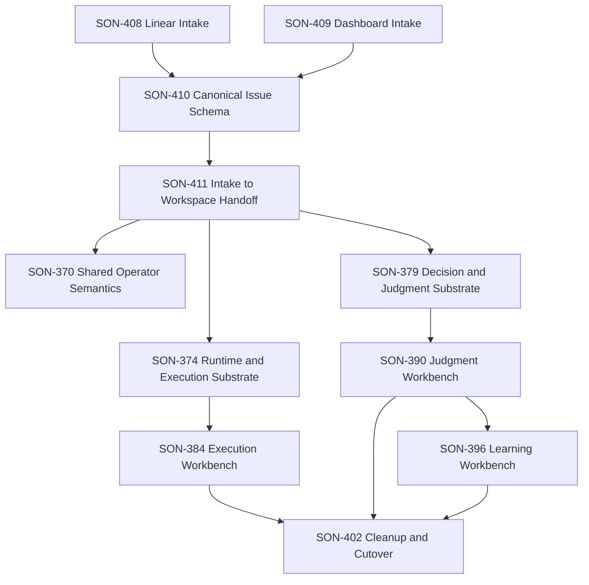

# Conversational Intake Linear Plan

> **Date:** 2026-04-01
> **Status:** created in Linear
> **Purpose:** map the new conversational-intake design layer into concrete
> Linear planning objects

## Overview

The intake layer is now represented in Linear as one new epic plus four child
issues.

This layer sits **upstream of** the current 7-Epic operator-workbench program.

It does not replace:

- `SON-370` Shared Operator Semantics
- `SON-374` Runtime and Execution Substrate
- `SON-379` Decision and Judgment Substrate
- `SON-384` Execution Workbench v1
- `SON-390` Judgment Workbench v1
- `SON-396` Learning Workbench v1
- `SON-402` Surface Cleanup and Workbench Cutover

Instead, it defines how work enters that program.

## Linear Objects

### Epic

- `SON-407` `[Epic] Conversational Intake and Acceptance Authoring`

### Child issues

- `SON-408` `Define Linear-native conversational intake and acceptance authoring`
- `SON-409` `Define Dashboard intake workspace`
- `SON-410` `Define canonical issue and acceptance schema`
- `SON-411` `Define intake-to-workspace handoff contract`

## Internal Dependency Shape

The intake epic currently has explicit internal structure:

- `SON-408` blocks `SON-410`
- `SON-409` blocks `SON-410`
- `SON-410` blocks `SON-411`

This reflects the intended sequence:

1. define authoring surfaces
2. define the canonical normalized issue shape
3. define the handoff seam into the workbench system

## Relationship to the Existing 7-Epic Program

The new intake layer should be read as:

## Source Documents

- [2026-04-01-conversational-intake-and-workflow-overview.md](./2026-04-01-conversational-intake-and-workflow-overview.md)
- [2026-04-01-linear-intake-and-acceptance-authoring-spec.md](./2026-04-01-linear-intake-and-acceptance-authoring-spec.md)
- [2026-04-01-dashboard-intake-workspace-spec.md](./2026-04-01-dashboard-intake-workspace-spec.md)
- [2026-04-01-canonical-issue-and-acceptance-schema.md](./2026-04-01-canonical-issue-and-acceptance-schema.md)
- [2026-04-01-intake-to-workspace-handoff-contract.md](./2026-04-01-intake-to-workspace-handoff-contract.md)
