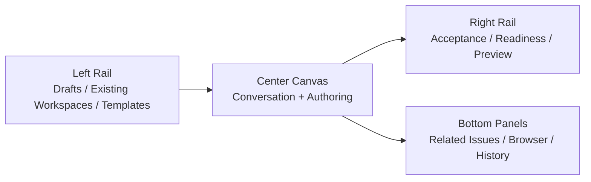

# Dashboard Intake Workspace Spec

> **Date:** 2026-04-01
> **Status:** draft v0
> **Purpose:** define the richer operator-facing intake surface in the
> Dashboard for mission drafting, issue normalization, and acceptance authoring

## Goal

Turn the Dashboard into the best place to:

- draft new work
- refine ambiguous work
- author acceptance interactively
- preview how the system understands the request
- launch a workspace once the issue is canonical

This is the richer alternative to Linear-native intake, not a separate truth
system.

## Relationship to the 7-Epic Program

Primary epic connections:

- `SON-384` Execution Workbench v1
- `SON-390` Judgment Workbench v1
- `SON-402` Surface Cleanup and Workbench Cutover

Secondary dependencies:

- `SON-370` Shared Operator Semantics
- `SON-379` Decision and Judgment Substrate

Meaning:

- this spec defines the pre-execution authoring surface
- once work is canonicalized, it hands off into the main workbench architecture

## User Story

When an operator is in the Dashboard, they should be able to create a new work
item through one stable intake workspace that shows:

- the evolving problem statement
- the evolving acceptance draft
- unresolved questions
- readiness checks
- the future execution/judgment implications of the issue

The operator should feel they are authoring a future workspace, not filling out
a form.

## Primary Screen Structure

## Core Panels

### 1. Intake Conversation

Shows:

- the ongoing authoring dialogue
- current system interpretation
- unresolved questions

### 2. Structured Draft

Editable structured representation:

- problem
- goal
- constraints
- acceptance
- evidence expectations

### 3. Readiness Panel

Shows:

- missing fields
- unresolved blockers
- recommendation:
  - stay in intake
  - write back to Linear
  - create workspace

### 4. Preview Panel

Shows what downstream systems will consume:

- canonical issue preview
- initial workspace summary
- likely run/judgment modes

## Current Codebase → Future Ownership

Current partial owners:

- [launcher.py](/Users/chris/.superset/worktrees/spec-orch/codexharness/src/spec_orch/dashboard/launcher.py)
- [api.py](/Users/chris/.superset/worktrees/spec-orch/codexharness/src/spec_orch/dashboard/api.py)
- [missions.py](/Users/chris/.superset/worktrees/spec-orch/codexharness/src/spec_orch/dashboard/missions.py)

Recommended future ownership:

- a distinct intake workspace surface inside `dashboard/*`
- thin API adapters that call intake normalization and acceptance authoring
  services

## Interaction Modes

The intake workspace should support:

- `new issue / mission`
- `refine existing Linear issue`
- `promote dashboard draft into Linear`
- `handoff to workspace creation`

## Debugging Model

If Dashboard intake goes wrong, inspect:

1. current draft state
2. latest normalization output
3. readiness computation
4. Linear writeback preview
5. workspace creation payload

Common failures:

- dashboard draft and Linear issue drift apart
- readiness is computed too early
- issue preview and downstream workspace disagree

## Done Criteria

This spec is realized when:

- the Dashboard can serve as a full intake workspace
- the operator can see the canonical issue preview before creation
- acceptance authoring is visible and editable
- readiness is explicit
- handoff to execution workspace is deterministic
