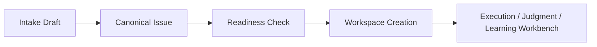

# Intake-to-Workspace Handoff Contract

> **Date:** 2026-04-01
> **Status:** draft v0
> **Purpose:** define the seam between conversational intake and the execution /
> judgment / learning workbench system

## Goal

Guarantee that once intake is complete, the system can create a workspace with
no ambiguity about:

- what the work is
- what acceptance means
- what downstream systems should consume

## Relationship to the 7-Epic Program

Primary epic connections:

- `SON-370` Shared Operator Semantics
- `SON-374` Runtime and Execution Substrate
- `SON-379` Decision and Judgment Substrate
- `SON-384` Execution Workbench v1
- `SON-390` Judgment Workbench v1

This is the contract that connects the new intake layer to the existing
workbench architecture.

## Handoff Rule

No workspace should be created from raw conversation directly.

Workspace creation must only occur after the issue has a canonical normalized
shape and a minimally sufficient acceptance contract.

## Required Inputs

Workspace creation must receive:

- canonical issue object
- acceptance summary
- unresolved question state
- source refs
- initial operator summary

## Required Outputs

On success, the handoff must create:

- `workspace_id`
- `subject_ref`
- `active execution placeholder`
- `initial judgment placeholder`
- `learning lineage placeholder`
- operator-readable workspace summary

## Handoff States

Recommended state machine:

- `draft_only`
- `canonicalized`
- `ready_for_workspace`
- `workspace_created`
- `handoff_failed`

## Handoff Graph

## Readiness Criteria

The system should refuse handoff if any of these are missing:

- stable title
- problem statement
- acceptance summary
- at least one verification expectation
- no blocking open question that invalidates planning

The system may still allow handoff with non-blocking uncertainty, but that
uncertainty must be explicit.

## Current Codebase → Future Ownership

Current partial owners:

- [launcher.py](/Users/chris/.superset/worktrees/spec-orch/codexharness/src/spec_orch/dashboard/launcher.py)
- [mission_execution_service.py](/Users/chris/.superset/worktrees/spec-orch/codexharness/src/spec_orch/services/mission_execution_service.py)
- [run_controller.py](/Users/chris/.superset/worktrees/spec-orch/codexharness/src/spec_orch/services/run_controller.py)

Recommended future ownership:

- intake/handoff service should own readiness checking and workspace creation
  payload generation
- execution and judgment systems should receive a fully normalized workspace
  subject, not raw intake prose

## User-Visible Contract

The user should see, before handoff:

- what will be created
- what is still uncertain
- why the system says it is or is not ready

The user should see, after handoff:

- which workspace was created
- what its initial execution mode is
- where to go next

## Debugging Model

If the handoff fails, inspect:

1. canonical issue payload
2. readiness reasons
3. workspace creation payload
4. workspace creation side effects
5. resulting workspace summary

Common failures:

- issue looks valid in prose but is not canonicalized enough for execution
- readiness checker is too strict or too loose
- workspace is created but missing initial acceptance context

## Done Criteria

This contract is done when:

- every workspace can be traced back to a canonical intake object
- handoff is deterministic and auditable
- readiness reasons are visible to users
- downstream execution and judgment layers no longer depend on informal intake
  state
