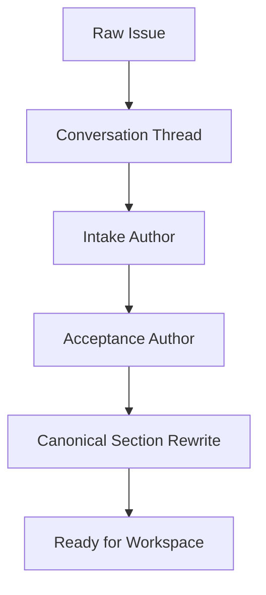

# Linear Intake and Acceptance Authoring Spec

> **Date:** 2026-04-01
> **Status:** draft v0
> **Purpose:** define how Linear becomes a true conversational source of truth
> for issue intent and acceptance authoring instead of a post-hoc sync target

## Goal

Make Linear a first-class intake surface where users can:

- state the problem
- clarify scope through dialogue
- author acceptance
- see unresolved questions
- understand what the system believes is still ambiguous

without requiring a separate hidden planning workflow first.

## Relationship to the 7-Epic Program

This spec is an **upstream front layer** that feeds the existing 7-Epic
operator-workbench program.

Primary epic connections:

- `SON-370` Shared Operator Semantics
- `SON-379` Decision and Judgment Substrate
- `SON-390` Judgment Workbench v1
- `SON-402` Surface Cleanup and Workbench Cutover

Practical meaning:

- this spec does not replace the 7 epics
- it defines how canonical issue truth is born before those epics consume it

## User Story

When a user opens or creates a Linear issue, they should be able to use
conversation to move the issue through these stages:

1. raw request
2. clarified problem
3. acceptance draft
4. resolved unknowns
5. canonical issue ready for workspace creation

The user should not need to manually translate freeform conversation into a
second hidden schema.

## Core Product Rule

Linear should remain canonical for:

- issue title
- problem statement
- acceptance summary
- open questions
- operator-readable status

Linear should not try to own:

- runtime event truth
- evidence bundle truth
- live judgment truth
- learning lineage truth

Those remain in the workspace-backed workbench.

## Target Linear Issue Shape

Every intake-ready issue should converge to this visible structure:

### Problem

- what is wrong
- who is affected
- why it matters now

### Goal

- what outcome should be achieved

### Constraints

- technical or product limits
- rollout or safety restrictions

### Acceptance

- what success looks like
- how it will be checked
- what counts as failure

### Evidence Expectations

- which routes, screens, artifacts, or traces matter

### Open Questions

- unresolved blockers or ambiguity

### Current System Understanding

- system-authored summary of current scope and readiness

## Conversational Authoring Loop

Linear-native intake should work like this:

### Responsibilities

#### Human

- states business problem
- answers clarification prompts
- approves the summarized interpretation

#### System

- extracts problem statement
- proposes acceptance
- identifies ambiguity
- rewrites issue into canonical structure
- marks readiness for workspace creation

## Required States

Linear intake should expose a lightweight authoring state.

Recommended states:

- `raw`
- `clarifying`
- `acceptance_drafting`
- `ready_for_workspace`
- `workspace_created`

These are intake states, not execution states.

## Current Codebase → Future Ownership

Current partial owners:

- [linear_client.py](/Users/chris/.superset/worktrees/spec-orch/codexharness/src/spec_orch/services/linear_client.py)
- [launcher.py](/Users/chris/.superset/worktrees/spec-orch/codexharness/src/spec_orch/dashboard/launcher.py)
- [spec_snapshot_service.py](/Users/chris/.superset/worktrees/spec-orch/codexharness/src/spec_orch/services/spec_snapshot_service.py)

Recommended future ownership:

- a dedicated `intake` or `authoring` service layer
- `LinearClient` remains a transport client
- normalization and acceptance authoring move out of dashboard handler logic

## Debugging Model

If Linear intake goes wrong, the operator should check:

1. raw issue body
2. latest intake summary comment
3. unresolved questions list
4. acceptance authoring diff
5. canonical rewrite payload

Common failures:

- issue marked ready before acceptance was actually clear
- canonical rewrite lost important nuance
- acceptance criteria became too implementation-shaped

## Done Criteria

This spec is realized when:

- a user can create or refine issue intent in Linear without leaving the issue
- acceptance appears as a first-class visible section
- unresolved ambiguity is explicit
- canonical rewrite is system-generated but operator-reviewable
- a ready issue can deterministically hand off to workspace creation
