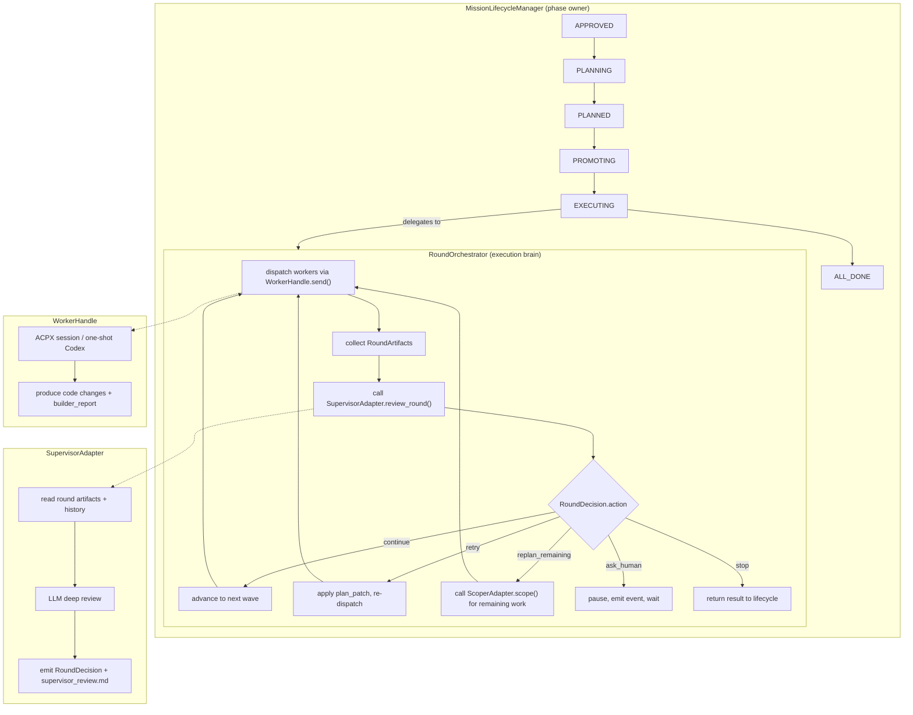

# Mission Supervisor Round Loop — 实施计划 v2

## 背景与动机

当前 spec-orch 的 Mission EXECUTING 阶段是个黑盒：`MissionLifecycleManager.auto_advance()` 在 EXECUTING 时不做任何事（`lifecycle_manager.py:212`），执行被整体委托给 `ParallelRunController.run_plan()` 一次性跑完，没有中间检查点。

实际场景（如 UI 多轮 review/迭代）需要一个新能力：**每轮 Codex 执行后，编排器自动收集结果、调用 Supervisor 做开放式策略判断、据此动态决定下一轮动作**。这不是固定的 gate 回溯（`recoverable -> execute`），而是由 LLM 做深度复盘后产出结构化决策。

## 核心设计决策

以下是三轮讨论中达成的共识，作为实施约束：

1. **Leader-Worker + Rich Artifacts + Thin Decision JSON**：不让单一 agent 长跑，而是 Supervisor 和 Worker 分离。结构化 decision 只承载调度意图，复杂推理放在 artifacts 里。

2. **RoundOrchestrator 独立于 MissionLifecycleManager**：round loop 嵌在现有 lifecycle 的 EXECUTING 阶段内，但实现在新服务 `RoundOrchestrator` 中。`MissionLifecycleManager` 只管 mission phase，不变成 God Object。

3. **SupervisorAdapter 是一等 Protocol**：与 `PlannerAdapter`（spec 阶段推理）、`ScoperAdapter`（plan 分解）同级的策略协议。Supervisor 的后端可以是 LiteLLM、ACPX 长会话、甚至人工审核，对编排器透明。

4. **WorkerHandle 是核心抽象，不是 phase 5 优化**：UI 迭代场景需要 Codex 保持上下文连续性。ACPX session 已提供此能力（`acpx codex -s <name> <prompt>` 跨进程保持对话历史），但缺少编排器侧的生命周期管理。WorkerHandle 封装 session 持久性，使 RoundOrchestrator 不关心底层是 ACPX session、one-shot Codex 还是 WebSocket 长连接。

5. **复用现有基础设施**：`ArtifactManifest` + `RunArtifactService`（工件索引）、`ContextAssembler`（LLM 上下文组装）、`EventBus`（状态事件）、`MissionState`（mission 内 issue 完成度追踪）等均复用，不建平行系统。

## 架构总览



---

## Phase 1: Domain 层 — 类型与协议

### 1.1 新增 domain 类型

文件：`src/spec_orch/domain/models.py`

在现有 `PacketResult`、`WaveResult`、`ExecutionPlanResult` 之后新增以下类型：

```python
class RoundStatus(StrEnum):
    """Round 在一个完整循环中的状态。"""
    EXECUTING = "executing"
    COLLECTING = "collecting"
    REVIEWING = "reviewing"
    DECIDED = "decided"
    COMPLETED = "completed"
    FAILED = "failed"


class RoundAction(StrEnum):
    """Supervisor 可发出的决策动作。"""
    CONTINUE = "continue"
    RETRY = "retry"
    REPLAN_REMAINING = "replan_remaining"
    ASK_HUMAN = "ask_human"
    STOP = "stop"


@dataclass
class SessionOps:
    """Supervisor 对 worker session 的操作指令。"""
    reuse: list[str] = field(default_factory=list)
    spawn: list[str] = field(default_factory=list)
    cancel: list[str] = field(default_factory=list)


@dataclass
class PlanPatch:
    """对剩余执行计划的结构化修改。"""
    modified_packets: dict[str, dict[str, Any]] = field(default_factory=dict)
    added_packets: list[dict[str, Any]] = field(default_factory=list)
    removed_packet_ids: list[str] = field(default_factory=list)
    reason: str = ""


@dataclass
class RoundDecision:
    """Supervisor 对一轮执行结果的结构化决策。

    富文本分析放在 artifacts 引用的文件里（如 supervisor_review.md），
    此 dataclass 只承载调度意图。
    """
    action: RoundAction
    reason_code: str = ""
    summary: str = ""
    confidence: float = 0.0
    affected_workers: list[str] = field(default_factory=list)
    artifacts: dict[str, str] = field(default_factory=dict)
    session_ops: SessionOps = field(default_factory=SessionOps)
    plan_patch: PlanPatch | None = None
    blocking_questions: list[str] = field(default_factory=list)

    def to_dict(self) -> dict[str, Any]:
        d: dict[str, Any] = {
            "action": self.action.value,
            "reason_code": self.reason_code,
            "summary": self.summary,
            "confidence": self.confidence,
            "affected_workers": self.affected_workers,
            "artifacts": self.artifacts,
            "session_ops": {
                "reuse": self.session_ops.reuse,
                "spawn": self.session_ops.spawn,
                "cancel": self.session_ops.cancel,
            },
            "blocking_questions": self.blocking_questions,
        }
        if self.plan_patch is not None:
            d["plan_patch"] = {
                "modified_packets": self.plan_patch.modified_packets,
                "added_packets": self.plan_patch.added_packets,
                "removed_packet_ids": self.plan_patch.removed_packet_ids,
                "reason": self.plan_patch.reason,
            }
        return d

    @classmethod
    def from_dict(cls, data: dict[str, Any]) -> RoundDecision:
        sops = data.get("session_ops", {})
        pp_raw = data.get("plan_patch")
        return cls(
            action=RoundAction(data["action"]),
            reason_code=data.get("reason_code", ""),
            summary=data.get("summary", ""),
            confidence=data.get("confidence", 0.0),
            affected_workers=data.get("affected_workers", []),
            artifacts=data.get("artifacts", {}),
            session_ops=SessionOps(
                reuse=sops.get("reuse", []),
                spawn=sops.get("spawn", []),
                cancel=sops.get("cancel", []),
            ),
            plan_patch=PlanPatch(**pp_raw) if pp_raw else None,
            blocking_questions=data.get("blocking_questions", []),
        )


@dataclass
class RoundArtifacts:
    """一轮执行后收集的全部工件引用。"""
    round_id: int
    mission_id: str
    builder_reports: list[dict[str, Any]] = field(default_factory=list)
    verification_outputs: list[dict[str, Any]] = field(default_factory=list)
    gate_verdicts: list[dict[str, Any]] = field(default_factory=list)
    manifest_paths: list[str] = field(default_factory=list)
    diff_summary: str = ""
    worker_session_ids: list[str] = field(default_factory=list)


@dataclass
class RoundSummary:
    """一轮完整循环的摘要记录，持久化到磁盘。"""
    round_id: int
    wave_id: int
    status: RoundStatus
    started_at: str = field(default_factory=lambda: datetime.now(UTC).isoformat())
    completed_at: str | None = None
    worker_results: list[dict[str, Any]] = field(default_factory=list)
    decision: RoundDecision | None = None

    def to_dict(self) -> dict[str, Any]:
        d: dict[str, Any] = {
            "round_id": self.round_id,
            "wave_id": self.wave_id,
            "status": self.status.value,
            "started_at": self.started_at,
            "completed_at": self.completed_at,
            "worker_results": self.worker_results,
        }
        if self.decision is not None:
            d["decision"] = self.decision.to_dict()
        return d

    @classmethod
    def from_dict(cls, data: dict[str, Any]) -> RoundSummary:
        dec_raw = data.get("decision")
        return cls(
            round_id=data["round_id"],
            wave_id=data["wave_id"],
            status=RoundStatus(data["status"]),
            started_at=data.get("started_at", ""),
            completed_at=data.get("completed_at"),
            worker_results=data.get("worker_results", []),
            decision=RoundDecision.from_dict(dec_raw) if dec_raw else None,
        )
```

### 1.2 新增 WorkerHandle 协议

文件：`src/spec_orch/domain/protocols.py`

```python
@runtime_checkable
class WorkerHandle(Protocol):
    """Persistent handle to a coding agent that supports follow-up prompts.

    Backed by ACPX sessions (context persists across subprocess invocations),
    one-shot Codex (each send() is independent), or future WebSocket backends.
    """

    @property
    def session_id(self) -> str:
        """Unique identifier for this worker session."""
        ...

    def send(
        self,
        *,
        prompt: str,
        workspace: Path,
        event_logger: Callable[[dict[str, Any]], None] | None = None,
    ) -> BuilderResult:
        """Send a prompt to this worker. For session-backed workers, this
        continues the existing conversation."""
        ...

    def cancel(self, workspace: Path) -> None:
        """Cancel any in-progress work in this session."""
        ...

    def close(self, workspace: Path) -> None:
        """Terminate this worker session and release resources."""
        ...
```

### 1.3 新增 SupervisorAdapter 协议

文件：`src/spec_orch/domain/protocols.py`

```python
@runtime_checkable
class SupervisorAdapter(Protocol):
    """Reviews each round's results and decides the next action.

    Sits between execution and the next round, providing open-ended
    strategic reasoning (unlike Gate which does structured policy checks).
    Same architectural level as PlannerAdapter and ScoperAdapter.
    """

    ADAPTER_NAME: str

    def review_round(
        self,
        *,
        round_artifacts: RoundArtifacts,
        plan: ExecutionPlan,
        round_history: list[RoundSummary],
        context: Any | None = None,
    ) -> RoundDecision:
        """Analyze this round's results and produce a structured decision.

        Implementations should also write rich artifacts (supervisor_review.md,
        findings.json) to the round directory referenced in round_artifacts.
        """
        ...
```

### 1.4 新增 WorkerHandleFactory 协议

文件：`src/spec_orch/domain/protocols.py`

```python
@runtime_checkable
class WorkerHandleFactory(Protocol):
    """Creates and manages WorkerHandle instances for a mission."""

    def create(
        self,
        *,
        session_id: str,
        workspace: Path,
    ) -> WorkerHandle:
        """Create or resume a worker session."""
        ...

    def get(self, session_id: str) -> WorkerHandle | None:
        """Return an existing handle, or None."""
        ...

    def close_all(self, workspace: Path) -> None:
        """Close all active sessions (mission cleanup)."""
        ...
```

---

## Phase 2: WorkerHandle 实现 — ACPX Session 封装

### 2.1 `AcpxWorkerHandle`

文件：新建 `src/spec_orch/services/workers/acpx_worker_handle.py`

核心逻辑：
- 构造时接收 `session_id`、`agent`、`model` 等 ACPX 配置
- `send()` 内部构造 `acpx <agent> -s <session_id> <prompt>` 命令，启动子进程，解析 JSON 行事件，等待退出
- 首次 `send()` 自动调 `_ensure_session()`（复用 `AcpxBuilderAdapter._ensure_session()` 的逻辑）
- `cancel()` 调 `acpx <agent> cancel -s <session_id>`
- `close()` 释放资源（目前 ACPX 无显式 session 删除命令，仅清理内部状态）

与 `AcpxBuilderAdapter` 的关系：提取 `_build_command()`、`_read_stdout()`、`_drain_stderr()`、`_ensure_session()` 等为共享工具函数（放在 `src/spec_orch/services/workers/_acpx_utils.py`），两者复用。**不修改** `AcpxBuilderAdapter` 的既有接口，保持单 issue 路径不变。

注意事项：
- `send()` 的 prompt 在首轮是完整任务描述（spec + acceptance criteria + files），续轮是 supervisor 给出的增量指令
- `send()` 返回标准 `BuilderResult`，包含 `succeeded`、`stdout`、`report_path` 等
- 进程超时控制复用 `absolute_timeout_seconds` 参数

### 2.2 `AcpxWorkerHandleFactory`

文件：新建 `src/spec_orch/services/workers/acpx_worker_handle_factory.py`

- `create()` 用 `session_id = f"mission-{mission_id}-{packet_id}"` 创建 `AcpxWorkerHandle`
- 内部维护 `dict[str, AcpxWorkerHandle]` 用于 `get()` 和 `close_all()`

### 2.3 `OneShotWorkerHandle`（fallback）

文件：新建 `src/spec_orch/services/workers/oneshot_worker_handle.py`

- 不维护 session，每次 `send()` 是独立的 `codex exec` 或 `acpx <agent> exec`
- `cancel()` 和 `close()` 为空操作
- 每次 `send()` 都发全量 prompt（因为没有上下文延续）

---

## Phase 3: RoundOrchestrator — 执行内核

### 3.1 核心类

文件：新建 `src/spec_orch/services/round_orchestrator.py`

```python
class RoundOrchestrator:
    """Drives the execute-review-decide loop within a mission's EXECUTING phase.

    Separated from MissionLifecycleManager to keep the phase owner
    and execution brain as distinct responsibilities.
    """

    DEFAULT_MAX_ROUNDS = 20

    def __init__(
        self,
        *,
        repo_root: Path,
        supervisor: SupervisorAdapter,
        worker_factory: WorkerHandleFactory,
        context_assembler: ContextAssembler,
        event_bus: EventBus | None = None,
        max_rounds: int = DEFAULT_MAX_ROUNDS,
    ) -> None: ...

    def run_supervised(
        self,
        *,
        mission_id: str,
        plan: ExecutionPlan,
        initial_round: int = 0,
    ) -> RoundOrchestratorResult: ...
```

### 3.2 `run_supervised()` 核心循环

伪代码：

```python
def run_supervised(self, *, mission_id, plan, initial_round=0):
    round_history: list[RoundSummary] = self._load_history(mission_id)
    current_wave_idx = self._determine_start_wave(plan, round_history)
    round_id = initial_round

    while round_id < self.max_rounds:
        round_id += 1
        wave = plan.waves[current_wave_idx]
        round_dir = self._round_dir(mission_id, round_id)
        round_dir.mkdir(parents=True, exist_ok=True)

        # --- Step 1: Dispatch workers ---
        summary = RoundSummary(round_id=round_id, wave_id=current_wave_idx,
                               status=RoundStatus.EXECUTING)
        worker_results = self._dispatch_wave(mission_id, wave, round_history)
        summary.worker_results = [self._serialize_result(r) for r in worker_results]
        summary.status = RoundStatus.COLLECTING

        # --- Step 2: Collect artifacts ---
        artifacts = self._collect_artifacts(mission_id, round_id, wave, worker_results)
        summary.status = RoundStatus.REVIEWING

        # --- Step 3: Supervisor review ---
        context = self.context_assembler.assemble(
            get_node_context_spec("supervisor"),
            self._build_supervisor_issue(mission_id),
            self._mission_workspace(mission_id),
            memory=self._get_memory(),
        )
        decision = self.supervisor.review_round(
            round_artifacts=artifacts,
            plan=plan,
            round_history=round_history,
            context=context,
        )
        summary.decision = decision
        summary.status = RoundStatus.DECIDED
        summary.completed_at = datetime.now(UTC).isoformat()
        self._persist_round(round_dir, summary, decision)

        # --- Step 4: Apply decision ---
        round_history.append(summary)

        match decision.action:
            case RoundAction.CONTINUE:
                self._apply_session_ops(mission_id, decision.session_ops)
                current_wave_idx += 1
                if current_wave_idx >= len(plan.waves):
                    return RoundOrchestratorResult(
                        completed=True, rounds=round_history)

            case RoundAction.RETRY:
                self._apply_session_ops(mission_id, decision.session_ops)
                if decision.plan_patch:
                    plan = self._apply_plan_patch(plan, decision.plan_patch)
                # current_wave_idx unchanged — re-execute same wave

            case RoundAction.REPLAN_REMAINING:
                self._apply_session_ops(mission_id, decision.session_ops)
                plan = self._replan_remaining(mission_id, plan,
                                              current_wave_idx, decision)

            case RoundAction.ASK_HUMAN:
                self._persist_state(mission_id, round_id, current_wave_idx)
                self.event_bus.emit_round_paused(
                    mission_id, round_id, decision.blocking_questions)
                return RoundOrchestratorResult(
                    completed=False, paused=True, rounds=round_history)

            case RoundAction.STOP:
                summary.status = RoundStatus.COMPLETED
                return RoundOrchestratorResult(
                    completed=True, rounds=round_history)

    # max_rounds exhausted
    return RoundOrchestratorResult(
        completed=False, max_rounds_hit=True, rounds=round_history)
```

### 3.3 `_dispatch_wave()` — 首轮 vs 续轮 prompt 策略

```python
def _dispatch_wave(self, mission_id, wave, round_history):
    results = []
    for packet in wave.work_packets:
        session_id = f"mission-{mission_id}-{packet.packet_id}"
        handle = self.worker_factory.get(session_id)

        if handle is None:
            # 首轮：创建 worker，发全量 prompt
            handle = self.worker_factory.create(
                session_id=session_id,
                workspace=self._packet_workspace(mission_id, packet),
            )
            prompt = self._build_initial_prompt(packet)
        else:
            # 续轮：从上一轮的 decision 中提取 follow-up 指令
            last_decision = round_history[-1].decision if round_history else None
            prompt = self._build_followup_prompt(packet, last_decision)

        result = handle.send(
            prompt=prompt,
            workspace=self._packet_workspace(mission_id, packet),
        )
        results.append((packet, result))
    return results
```

### 3.4 `_collect_artifacts()` — 工件收集

从每个 packet workspace 中收集：
- `builder_report.json`（BuilderResult 的序列化）
- `run_artifact/manifest.json`（如果走了完整 RunController 路径）
- `git diff` 摘要（本轮代码变更）
- verification 输出（如果本轮包含 verify 步骤）

返回 `RoundArtifacts` dataclass。

### 3.5 `_persist_round()` — 轮次工件存储

目录结构：
```
docs/specs/{mission_id}/rounds/
  round-01/
    round_summary.json       # RoundSummary.to_dict()
    round_decision.json      # RoundDecision.to_dict()
    supervisor_review.md     # Supervisor 产出的富文本分析
    findings.json            # 结构化问题列表（可选）
    plan_patch.json          # 对计划的修改（可选）
  round-02/
    ...
```

### 3.6 `_apply_session_ops()` — Worker 生命周期管理

```python
def _apply_session_ops(self, mission_id, session_ops):
    for sid in session_ops.cancel:
        handle = self.worker_factory.get(sid)
        if handle:
            handle.cancel(self._mission_workspace(mission_id))
            handle.close(self._mission_workspace(mission_id))

    for sid in session_ops.spawn:
        self.worker_factory.create(
            session_id=sid,
            workspace=self._mission_workspace(mission_id),
        )
    # reuse: no action needed — handles persist in factory
```

### 3.7 `RoundOrchestratorResult`

```python
@dataclass
class RoundOrchestratorResult:
    completed: bool
    paused: bool = False
    max_rounds_hit: bool = False
    rounds: list[RoundSummary] = field(default_factory=list)

    @property
    def last_decision(self) -> RoundDecision | None:
        if self.rounds and self.rounds[-1].decision:
            return self.rounds[-1].decision
        return None
```

---

## Phase 4: Lifecycle 集成

### 4.1 修改 `MissionLifecycleManager.auto_advance()`

文件：`src/spec_orch/services/lifecycle_manager.py`

当前 `auto_advance()` 在 EXECUTING 时直接返回 state：

```python
# 当前代码 (lifecycle_manager.py:212-228)
def auto_advance(self, mission_id):
    state = self._states.get(mission_id)
    if state.phase == MissionPhase.APPROVED:
        return self._do_plan(mission_id)
    if state.phase == MissionPhase.PLANNED:
        return self._do_promote(mission_id)
    if state.phase == MissionPhase.ALL_DONE:
        return self._do_retro_and_evolve(mission_id)
    return state  # EXECUTING 时什么都不做
```

改为：

```python
def auto_advance(self, mission_id):
    state = self._states.get(mission_id)
    if state.phase == MissionPhase.APPROVED:
        return self._do_plan(mission_id)
    if state.phase == MissionPhase.PLANNED:
        return self._do_promote(mission_id)
    if state.phase == MissionPhase.EXECUTING:
        return self._do_execute(mission_id)   # 新增
    if state.phase == MissionPhase.ALL_DONE:
        return self._do_retro_and_evolve(mission_id)
    return state
```

`_do_execute()` 的实现：

```python
def _do_execute(self, mission_id):
    if self._round_orchestrator is None:
        return self._states[mission_id]  # 无 supervisor → 保持原有行为

    plan = ParallelRunController.load_plan(mission_id, self.repo_root)
    state = self._states[mission_id]
    result = self._round_orchestrator.run_supervised(
        mission_id=mission_id,
        plan=plan,
        initial_round=state.current_round,
    )

    state.current_round = len(result.rounds)
    self._save_state()

    if result.completed:
        return self._transition(mission_id, MissionPhase.ALL_DONE)
    if result.paused:
        return state  # 保持 EXECUTING，等人工介入后再 tick
    if result.max_rounds_hit:
        return self._transition(mission_id, MissionPhase.FAILED,
                                error="max_rounds_exhausted")
    return state
```

### 4.2 修改 `MissionState`

文件：`src/spec_orch/services/lifecycle_manager.py`

在现有 `MissionState` dataclass 中新增：

```python
@dataclass
class MissionState:
    mission_id: str
    phase: MissionPhase
    issue_ids: list[str] = field(default_factory=list)
    completed_issues: list[str] = field(default_factory=list)
    error: str | None = None
    updated_at: str = field(default_factory=lambda: datetime.now(UTC).isoformat())
    current_round: int = 0                                         # 新增
    round_orchestrator_state: dict[str, Any] = field(default_factory=dict)  # 新增
```

`round_orchestrator_state` 存放 RoundOrchestrator 在 daemon tick 间恢复所需的最小状态（如当前 wave index、活跃 session 列表等）。

### 4.3 修改 `MissionLifecycleManager.__init__()`

新增可选的 `round_orchestrator` 依赖注入：

```python
def __init__(
    self,
    repo_root: Path,
    event_bus: EventBus | None = None,
    round_orchestrator: RoundOrchestrator | None = None,  # 新增
) -> None:
    self.repo_root = Path(repo_root)
    self._bus = event_bus or get_event_bus()
    self._round_orchestrator = round_orchestrator
    self._states: dict[str, MissionState] = {}
    self._context_assembler = ContextAssembler()
    self._memory: Any | None = None
    self._load_state()
```

---

## Phase 5: Supervisor 实现

### 5.1 `LiteLLMSupervisorAdapter`

文件：新建 `src/spec_orch/services/litellm_supervisor_adapter.py`

核心逻辑：
- 使用 LiteLLM 调用任意 LLM（OpenAI/Anthropic/Deepseek/...）
- system prompt 定义 Supervisor 角色和输出格式约束
- user prompt 注入：当前 plan 全文、本轮 builder_report 摘要、本轮 verification 结果、前几轮 round_decision 历史、ContextAssembler 组装的代码库上下文
- 要求 LLM 输出两部分：
  1. `supervisor_review.md`：自由文本深度分析（为什么这样判断、备选路径、风险评估）
  2. `round_decision.json`：结构化 RoundDecision（薄 JSON，只承载调度意图）
- 解析 LLM 输出，将 markdown 和 JSON 分别写入 round 目录
- 返回 `RoundDecision` dataclass

### 5.2 Supervisor system prompt 要点

```
你是 Mission Supervisor。你的职责是审查每轮 Codex 执行的结果，判断下一步应该怎么做。

你会收到：
1. 当前执行计划的全文
2. 本轮每个 worker 的执行报告（成功/失败、代码变更摘要、verification 输出）
3. 前几轮的决策历史

你必须输出：
1. 一段 Markdown 分析（写入 supervisor_review.md）
2. 一个 JSON 决策（写入 round_decision.json）

决策的 action 字段必须是以下之一：
- continue: 本轮成功，推进到下一个 wave
- retry: 本轮部分失败，重试指定 worker（可附带 plan_patch 修改指令）
- replan_remaining: 需要对剩余计划做重大调整
- ask_human: 需要人工决策（填写 blocking_questions）
- stop: 所有工作完成或不可恢复失败
```

### 5.3 ContextAssembler 新增 supervisor node spec

文件：`src/spec_orch/services/context/node_context_registry.py`

新增 `supervisor` entry：

```python
"supervisor": NodeContextSpec(
    node_name="supervisor",
    include_spec=True,
    include_file_tree=True,
    include_diff=True,
    include_builder_events=True,
    include_verification=True,
    include_review=True,
    include_memory_episodic=True,
    max_tokens_budget=8000,
),
```

---

## Phase 6: Daemon 接入

### 6.1 `spec-orch.toml` 配置扩展

```toml
[supervisor]
adapter = "litellm"            # 或未来的 "acpx_session"
model = "openai/gpt-4o"       # supervisor 用的模型
max_rounds = 20
```

### 6.2 修改 `daemon.py`

文件：`src/spec_orch/services/daemon.py`

在 `_tick_missions()` 中构造 `RoundOrchestrator` 并注入 `MissionLifecycleManager`：

```python
def _build_round_orchestrator(self) -> RoundOrchestrator | None:
    supervisor_config = self.config.supervisor  # 从 spec-orch.toml 读取
    if not supervisor_config:
        return None
    supervisor = self._build_supervisor_adapter(supervisor_config)
    worker_factory = AcpxWorkerHandleFactory(
        agent=self.config.builder_agent,
        model=self.config.builder_model,
    )
    return RoundOrchestrator(
        repo_root=self.repo_root,
        supervisor=supervisor,
        worker_factory=worker_factory,
        context_assembler=ContextAssembler(),
    )
```

---

## Phase 7: 修复 inject_btw（独立 bugfix）

### 7.1 问题

`inject_btw()` 写入 `.spec_orch_runs/{issue_id}/btw_context.md`，但 `RunController._render_builder_envelope()` 不读此文件。注释说 "builder prompt picks it up on next retry" 但实际未实现。

### 7.2 修复方案

在 `RunController._render_builder_envelope()` 中（约 `run_controller.py:1500` 附近），在拼接 prompt 时检查 btw_context.md 是否存在，若存在则追加到 prompt 中：

```python
btw_path = workspace / "btw_context.md"
if not btw_path.exists():
    btw_path = self.repo_root / ".spec_orch_runs" / issue_id / "btw_context.md"
if btw_path.exists():
    btw_content = btw_path.read_text(encoding="utf-8").strip()
    if btw_content:
        sections.append(f"## Additional Context (injected via /btw)\n\n{btw_content}")
```

同时需要统一 worktree 路径和 `.spec_orch_runs` 路径的映射关系。

---

## 实施顺序

```
Phase 1: Domain 层类型与协议                [无依赖，纯新增]
    ↓
Phase 2: WorkerHandle ACPX 实现            [依赖 Phase 1 的 WorkerHandle protocol]
    ↓
Phase 3: RoundOrchestrator                 [依赖 Phase 1+2]
    ↓
Phase 4: Lifecycle 集成                    [依赖 Phase 3]
    ↓
Phase 5: LiteLLM Supervisor 实现           [依赖 Phase 1，可与 Phase 3 并行]
    ↓
Phase 6: Daemon 接入                       [依赖 Phase 3+4+5]
    ↓
Phase 7: 修复 inject_btw                   [独立，可随时做]
```

Phase 5（LiteLLM Supervisor）可以和 Phase 3 并行开发，因为它只依赖 Phase 1 的协议定义。

## 与现有代码的关系

- `domain/models.py` — **新增**类型，不改已有类型
- `domain/protocols.py` — **新增** WorkerHandle / WorkerHandleFactory / SupervisorAdapter，不改已有协议
- `services/lifecycle_manager.py` — **修改** auto_advance() 和 MissionState，新增 _do_execute()
- `services/round_orchestrator.py` — **新建**
- `services/workers/` — **新建**目录，包含 acpx_worker_handle.py、oneshot_worker_handle.py、acpx_worker_handle_factory.py
- `services/litellm_supervisor_adapter.py` — **新建**
- `services/context/node_context_registry.py` — **小改**，新增 supervisor entry
- `services/daemon.py` — **小改**，构造 RoundOrchestrator 并注入
- `services/builders/acpx_builder_adapter.py` — **提取**共享工具函数，不改接口
- `services/run_controller.py` — **小改**修复 btw_context 读取
- `services/parallel_run_controller.py` — **不改**
- `services/gate_service.py` — **不改**

## 风险与缓解

- **max_rounds 耗尽**：默认 20 轮，每轮持久化 RoundSummary，daemon 可在 tick 间恢复。ask_human 提供人工出口。
- **ACPX session 上下文膨胀**：长会话后 ACPX session 可能超出 context window。缓解：supervisor 可在 decision 中发 `cancel` + `spawn` 指令，用新 session 替换旧 session。
- **Supervisor 输出解析失败**：LLM 可能不严格遵循 JSON schema。缓解：在 `LiteLLMSupervisorAdapter` 中做宽松解析 + fallback（解析失败时默认 `ask_human`）。
- **daemon 进程中断后恢复**：RoundSummary 和 MissionState 持久化到磁盘，daemon 重启后从 `current_round` 和 round history 恢复。
