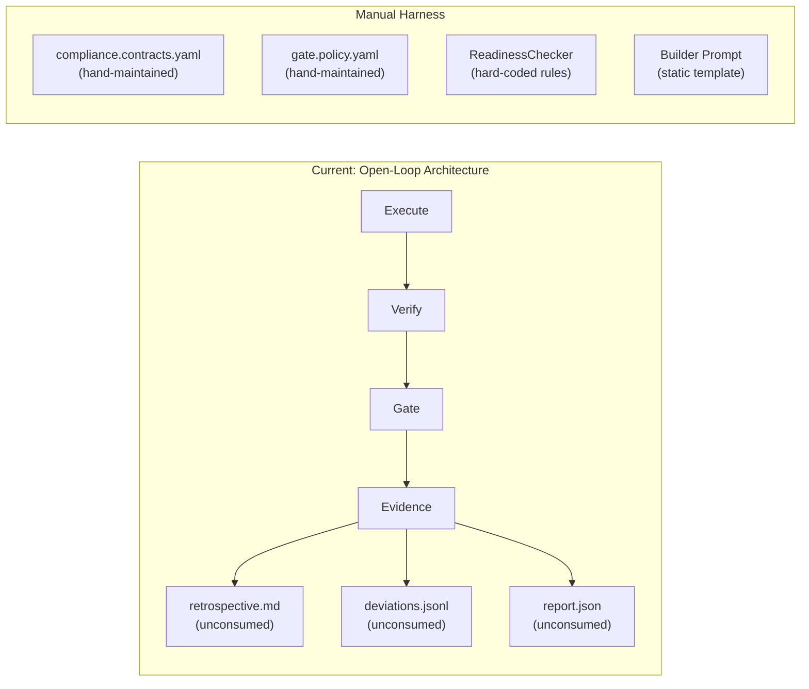
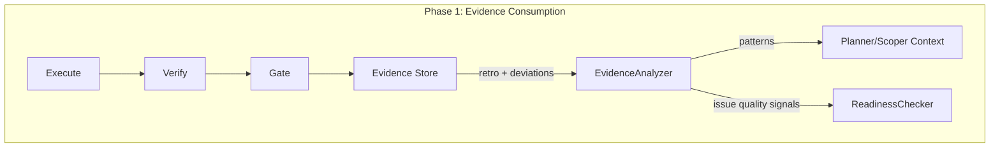
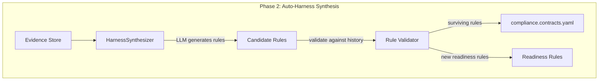
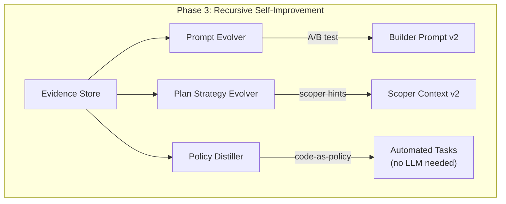

# Self-Evolution: AutoHarness-Inspired Closed-Loop Improvement

> **Status: COMPLETED** — All three phases implemented in Epic SON-74 (8 issues).
> Merged to `main` in v0.3.0 on 2026-03-14.

## 1. Vision

SpecOrch is not just an orchestrator that dispatches tasks to coding agents.
Its long-term goal is to become a **self-evolving AI engineering system** —
one that learns from every execution, automatically tightens its own
constraints, and progressively reduces both cost and failure rate without
human intervention.

At v0.2 the system was **open-loop**: it produced rich evidence
(retrospectives, deviation logs, gate reports) but none of that evidence
flowed back to influence future planning, building, or gating. Every run
started from the same static prompts and hand-written compliance rules.

As of v0.3 (this spec), the loop is **closed** across all three stages:

```
v0.2  Open-loop — manual constraints, fixed prompts        ✅ shipped
v0.3  Closed-loop + Auto-synthesis + Recursive + Policy    ✅ shipped (this spec)
      ├── Evidence feeds back to planner/readiness
      ├── LLM generates compliance rules from failures
      ├── Prompts and plan strategies evolve automatically
      └── Recurring tasks distilled to zero-LLM code policies
```

### Theoretical Foundation

This roadmap is directly inspired by the
[AutoHarness](https://arxiv.org/abs/2603.03329) paper (Google DeepMind,
2026.02), which demonstrated that:

- 78 % of LLM agent failures are **structural illegal moves**, not strategy
  errors.
- Hand-written harnesses (constraints / guardrails) are brittle and do not
  scale.
- Letting the LLM **synthesize its own constraint code** through iterative
  refinement and environment feedback dramatically improves performance.
- A small model with auto-harness consistently outperforms a large model
  without one (Gemini-2.5-Flash + harness > Gemini-2.5-Pro).
- In the extreme case the entire policy can be distilled into deterministic
  code, eliminating runtime LLM calls entirely.

The paper defines three autonomy levels:

| Level | Name | Description |
|-------|------|-------------|
| 1 | harness-as-action-verifier | LLM proposes action; code validates legality |
| 2 | harness-as-action-filter | Code generates legal-action set; LLM picks best |
| 3 | harness-as-policy | Pure code policy; no LLM needed at runtime |

SpecOrch already operates at Level 1 (compliance contracts verify builder
output). This roadmap takes us through Level 2 and toward Level 3.


## 2. Current State Analysis

### 2.1 Mapping to AutoHarness Concepts

| AutoHarness concept | spec-orch equivalent | Status |
|---------------------|---------------------|--------|
| `is_legal_action()` | `compliance.contracts.yaml` | Manual, does not self-evolve |
| `propose_action()` | Builder Prompt + Scoper | Fixed template, no historical learning |
| Environment feedback | Verification (ruff / mypy / pytest) + Gate | Feedback exists but never flows back |
| Tree search / refinement | — | Not implemented |
| Code-as-policy | — | Not implemented |

### 2.2 Architecture Diagram — Current Open Loop



### 2.3 Six Broken Feedback Loops

1. **Retrospective is unconsumed.** `spec-orch retro` generates
   `retrospective.md`, but Planner, Scoper, and ReadinessChecker never read
   it.

2. **Deviations are ignored.** `deviations.jsonl` records out-of-scope file
   changes, but `within_boundaries` is hard-coded to `True` in the gate
   evaluator.

3. **Compliance has no auto-learning.** All compliance rules are hand-written
   YAML. Recurring violation patterns never become new rules.

4. **Builder prompt does not evolve.** Every build uses the same prompt
   template regardless of historical success or failure rates.

5. **Plan quality gets no feedback.** Scoper generates wave / packet DAGs
   without referencing which past decomposition strategies worked well.

6. **Readiness does not adapt.** ReadinessChecker uses three hard-coded rules
   (Goal / AC / Files) and does not learn from issues that failed after
   passing triage.


## 3. Architecture Plan

### Phase 1 — Evidence Consumption (Closing the Loop)

**Core idea:** Make existing evidence consumable instead of leaving it on
disk.



Components:

- **`EvidenceAnalyzer` service** — reads all historical run data
  (`report.json`, `deviations.jsonl`, `retrospective.md`) and extracts
  patterns such as:
  - "5 of the last 10 runs failed due to ruff lint errors"
  - "database-related issues average 2.3 retries"
  - "out-of-scope changes cluster in the `tests/` directory"

- **Scoper context injection** — when `spec-orch plan` runs, the evidence
  summary is added to the LLM system prompt so the scoper can learn from
  past decompositions.

- **Readiness context injection** — when `ReadinessChecker` performs its LLM
  check, historical pass/fail rates for similar issues are attached.

- **`within_boundaries` enforcement** — connect deviation detection to gate
  evaluation so out-of-scope changes actually affect the gate result.

Key files:
- New: `src/spec_orch/services/evidence_analyzer.py`
- Modified: `src/spec_orch/services/scoper_adapter.py`
- Modified: `src/spec_orch/services/readiness_checker.py`
- Modified: `src/spec_orch/services/run_controller.py`

### Phase 2 — Auto-Harness Synthesis (Self-Generated Constraints)

**Core idea:** Mirror the AutoHarness paper — let the LLM generate new
compliance rules from execution failures.



Components:

- **`HarnessSynthesizer` service**:
  1. Collects gate failures, verification failures, and deviation records
     from the last N runs.
  2. Prompts an LLM to analyze failure patterns and propose candidate
     compliance rules (YAML format).
  3. Back-tests candidates against historical data: false-positive rate,
     coverage of past failures.
  4. Rules that pass back-testing are merged into
     `compliance.contracts.yaml`.

- **Rule Validator** — iterates until the new rule set has zero false
  positives on historical data. Analogous to AutoHarness's "iterate until
  100 % legal."

Example auto-synthesized rule:

```yaml
- id: auto-no-test-import-production
  name: "No test imports in production code"
  description: "Auto-generated from 3 deviations in runs SPC-42, SPC-45, SPC-48"
  generated_at: "2026-03-10T14:00:00Z"
  source: "harness-synthesizer"
  check: pattern
  pattern: "import.*pytest|from.*conftest"
  event_type: "file_change"
  scope: "src/"
  severity: error
```

Key files:
- New: `src/spec_orch/services/harness_synthesizer.py`
- Modified: `src/spec_orch/services/compliance_engine.py`
- New CLI: `spec-orch harness synthesize`

### Phase 3 — Recursive Self-Improvement

**Core idea:** Evolve the system's own prompts, planning strategies, and
ultimately distill routine tasks into deterministic code.



Components:

- **Prompt Evolver**:
  - Maintains versioned builder prompt history.
  - After every N runs, uses an LLM to compare success/failure rates across
    prompt variants.
  - Automatically A/B tests new prompt candidates.
  - The winning prompt becomes the new default.

- **Plan Strategy Evolver**:
  - Analyzes which wave / packet decomposition strategies correlate with
    fewer failures and deviations.
  - Generates "scoper hints" (e.g., "database migrations should be isolated
    in wave-0").
  - Hints are injected into the scoper's system prompt.

- **Policy Distiller** (long-term, analogous to harness-as-policy):
  - For recurring simple tasks (e.g., "update documentation", "fix lint"),
    generates deterministic Python code workflows.
  - Executes without calling the LLM, reducing cost to near zero.
  - Mirrors the paper's finding: pure code policies outperform even the best
    LLMs on well-understood tasks.

Key files:
- New: `src/spec_orch/services/prompt_evolver.py`
- New: `src/spec_orch/services/plan_strategy_evolver.py`
- New: `src/spec_orch/services/policy_distiller.py`
- Modified: `src/spec_orch/services/codex_exec_builder_adapter.py`
- Modified: `src/spec_orch/services/scoper_adapter.py`


## 4. Concept Mapping to AutoHarness

| Paper concept | spec-orch implementation | Phase |
|---------------|------------------------|-------|
| Environment feedback | `VerificationService` outputs (ruff/mypy/pytest) + Gate results | Existing |
| Code refinement (Refiner) | `HarnessSynthesizer` generates compliance rules from failure patterns | 2 |
| Tree search (Thompson sampling) | Maintain multiple candidate rules; use historical data as reward signal | 2 |
| Iteration until 100 % legal | Loop until new rule set has zero false positives on historical runs | 2 |
| harness-as-verifier | Auto-generated `compliance.contracts.yaml` | 2 |
| harness-as-filter | ReadinessChecker with historical context pre-filters immature issues | 1 |
| harness-as-policy | Policy Distiller encodes routine tasks as deterministic code | 3 |
| Distill back to base LLM | Scoper hints and prompt improvements become default behavior | 3 |


## 5. Epic and Issue Breakdown

All issues below belong to the epic **"Self-Evolution: AutoHarness-inspired
closed-loop improvement"** on the Linear board.

### Phase 1 — Evidence Consumption (3 issues)

| # | Title | Goal | Key files |
|---|-------|------|-----------|
| 1 | Enforce `within_boundaries` in gate evaluation | Connect deviation detection to gate so out-of-scope changes affect the result; remove the hard-coded `True` | `run_controller.py`, `gate_service.py` |
| 2 | EvidenceAnalyzer MVP | Service that reads `.spec_orch_runs/*/report.json` and `deviations.jsonl`, produces a pattern summary (success rate, top-5 failure reasons, top-10 high-deviation files) | New `evidence_analyzer.py` |
| 3 | Inject evidence context into Scoper and ReadinessChecker | Wire `EvidenceAnalyzer` output into the LLM system prompts of `scoper_adapter.py` and `readiness_checker.py` | `scoper_adapter.py`, `readiness_checker.py`, `litellm_planner_adapter.py` |

### Phase 2 — Auto-Harness Synthesis (2 issues)

| # | Title | Goal | Key files |
|---|-------|------|-----------|
| 4 | HarnessSynthesizer MVP | LLM analyzes recent failures and proposes candidate compliance rules in YAML; CLI `spec-orch harness synthesize` triggers generation | New `harness_synthesizer.py`, `cli.py` |
| 5 | Rule Validator and auto-merge | Back-test candidates against historical runs; auto-merge surviving rules into `compliance.contracts.yaml` | `harness_synthesizer.py`, `compliance_engine.py` |

### Phase 3 — Recursive Self-Improvement (3 issues)

| # | Title | Goal | Key files |
|---|-------|------|-----------|
| 6 | Prompt Evolver | Versioned builder prompt history, A/B test framework, auto-promote winning prompt variant | New `prompt_evolver.py`, `codex_exec_builder_adapter.py` |
| 7 | Plan Strategy Evolver | Analyze historical plan outcomes, generate scoper hints, inject into scoper system prompt | New `plan_strategy_evolver.py`, `scoper_adapter.py` |
| 8 | Policy Distiller | For recurring simple tasks, generate deterministic Python workflows that execute without LLM calls | New `policy_distiller.py` |


## 6. Constraints

- Each phase builds on the previous one; issues within a phase can be
  parallelized but phases are sequential.
- No new required dependencies. LLM calls go through the existing
  `LiteLLMPlannerAdapter` configuration.
- All auto-generated rules and prompt variants must be human-reviewable and
  reversible.
- The Policy Distiller (issue 8) is a long-term research item and may be
  deferred beyond v0.5.
